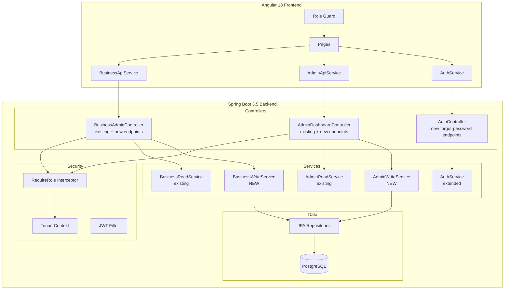

# Design Document: Web Admin Full Capability

## Overview

This design transforms the KhanaBook Web Admin from a read-only monitoring panel into a full management console. The work spans 14 requirement areas across the Angular 18 frontend and Spring Boot 3.5 backend, introducing write endpoints for staff CRUD, menu management, terminal reactivation, business lifecycle, and password recovery — plus interactive dashboard/order enhancements (date filtering, drill-down navigation, CSV export, order detail modals).

The approach follows the existing architecture patterns:
- **Backend**: New write services and controllers alongside existing read-only `BusinessReadService`, leveraging `TenantContext` for multi-tenancy and adding `@PreAuthorize`-style role checks.
- **Frontend**: New Angular standalone components with inline templates/styles, reactive forms for data entry, client-side filtering/pagination, and Angular Signals for state.

### Key Design Decisions

1. **Separate Write Services**: New `BusinessWriteService`, `AdminWriteService` classes keep write logic isolated from existing read paths, reducing regression risk.
2. **Server-Side Role Enforcement**: A `@RequireRole` custom annotation + Spring AOP interceptor replaces scattered `if` checks, providing a single enforcement point that returns HTTP 403.
3. **Client-Side Date Filtering**: Date ranges are applied client-side to already-fetched data (orders, dashboard), since data volumes are small per-business. A server-side `from`/`to` parameter is added to the dashboard endpoint for KPI recalculation.
4. **Soft Delete for Menu Items**: Deletion marks items as `isAvailable=false` and `isDeleted=true` rather than physical removal, preserving referential integrity with existing `BillItem` records.
5. **OTP via Existing WhatsApp Channel**: Password reset reuses the existing WhatsApp OTP infrastructure (same as Android app), keeping the auth flow consistent.
6. **Business Suspension via New Column**: A new `is_suspended` column on `restaurantprofiles` controls business status, checked at login time by `AuthService`.

---

## Architecture



### Request Flow for Write Operations

1. Angular calls write endpoint (POST/PUT/DELETE)
2. JWT filter extracts token → sets `TenantContext` (tenantId, role, userId)
3. `@RequireRole` AOP interceptor reads `TenantContext.getCurrentRole()`, rejects with 403 if unauthorized
4. Controller delegates to write service
5. Write service executes business logic, calls repository
6. Response returns to Angular, which updates local state via signals

---

## Components and Interfaces

### Backend Components

#### 1. RequireRole Annotation + Interceptor

```java
@Target(ElementType.METHOD)
@Retention(RetentionPolicy.RUNTIME)
public @interface RequireRole {
    UserRole[] value();
}
```

An AOP `@Around` advice reads `TenantContext.getCurrentRole()` and throws `AccessDeniedException` (mapped to 403) if the caller's role is not in the allowed set.

#### 2. BusinessWriteService (NEW)

Handles all business-level write operations:
- `createStaff(Long restaurantId, CreateStaffRequest req) → StaffCreatedResponse`
- `updateStaff(Long restaurantId, Long userId, UpdateStaffRequest req) → void`
- `deactivateStaff(Long restaurantId, Long userId) → void`
- `createMenuItem(Long restaurantId, CreateMenuItemRequest req) → BusinessMenuListItemResponse`
- `updateMenuItem(Long restaurantId, Long menuItemId, UpdateMenuItemRequest req) → BusinessMenuListItemResponse`
- `deleteMenuItem(Long restaurantId, Long menuItemId) → void`
- `toggleMenuItemAvailability(Long restaurantId, Long menuItemId) → BusinessMenuListItemResponse`
- `reactivateTerminal(Long restaurantId, Long terminalId) → void`

#### 3. AdminWriteService (NEW)

Handles platform-admin write operations:
- `suspendBusiness(Long restaurantId) → void`
- `activateBusiness(Long restaurantId) → void`

#### 4. AuthController Extensions

New endpoints for forgot-password flow:
- `POST /auth/forgot-password/request-otp` — sends OTP to registered WhatsApp
- `POST /auth/forgot-password/verify-otp` — validates OTP, returns temp token
- `POST /auth/forgot-password/reset-password` — sets new password using temp token

#### 5. BusinessReadService Extensions

- `getDashboard(Long restaurantId, LocalDate from, LocalDate to)` — overloaded with date range
- `getOrders(Long restaurantId, LocalDate from, LocalDate to)` — overloaded with date range
- `getOrderDetail(Long restaurantId, Long billId)` — returns order + line items

### Frontend Components

#### 6. BusinessApiService Extensions

```typescript
// Staff CRUD
createStaff(payload: CreateStaffRequest): Observable<StaffCreatedResponse>
updateStaff(userId: number, payload: UpdateStaffRequest): Observable<void>
deactivateStaff(userId: number): Observable<void>

// Menu CRUD
createMenuItem(payload: CreateMenuItemRequest): Observable<BusinessMenuItem>
updateMenuItem(menuItemId: number, payload: UpdateMenuItemRequest): Observable<BusinessMenuItem>
deleteMenuItem(menuItemId: number): Observable<void>
toggleMenuItemAvailability(menuItemId: number): Observable<BusinessMenuItem>

// Terminal
reactivateTerminal(terminalId: number): Observable<void>

// Dashboard/Orders with date range
getDashboard(from?: string, to?: string): Observable<BusinessDashboard>
getOrders(from?: string, to?: string): Observable<BusinessOrder[]>
getOrderDetail(billId: number): Observable<OrderDetailResponse>
```

#### 7. AdminApiService Extensions

```typescript
suspendBusiness(restaurantId: number): Observable<void>
activateBusiness(restaurantId: number): Observable<void>
```

#### 8. AuthService Extensions

```typescript
requestPasswordOtp(phone: string): Observable<void>
verifyPasswordOtp(phone: string, otp: string): Observable<{ tempToken: string }>
resetPassword(tempToken: string, newPassword: string): Observable<void>
```

#### 9. Updated Page Components

| Component | Changes |
|-----------|---------|
| `StaffPageComponent` | Add Staff button, edit/deactivate actions, staff form modal |
| `MenuPageComponent` | Add Item button, edit/delete actions, availability toggle, menu form modal |
| `TerminalsPageComponent` | Reactivate button for deactivated terminals |
| `BusinessDashboardPageComponent` | Refresh button, date range selector, clickable stat cards |
| `OrdersPageComponent` | Date filter, row click → detail modal, CSV export button |
| `BusinessesPageComponent` | Suspend/Activate buttons per row |
| `LoginPageComponent` | Forgot Password link → multi-step reset flow |

#### 10. New Shared UI Elements

- **ConfirmDialogComponent**: Reusable confirmation modal with title, message, confirm/cancel buttons
- **DateRangeSelectorComponent**: Preset buttons (Today, This Week, This Month, Custom) + date pickers
- **OrderDetailModalComponent**: Full order view with line items table

---

## Data Models

### New/Modified DTOs (Backend)

```java
// Staff Creation
record CreateStaffRequest(String name, String phone, UserRole role, @Nullable String email) {}
record StaffCreatedResponse(Long userId, String name, String phone, String role, String temporaryPassword) {}

// Staff Update
record UpdateStaffRequest(String name, String phone, @Nullable String email, UserRole role) {}

// Menu Item Creation/Update
record CreateMenuItemRequest(String name, Long categoryId, String foodType, BigDecimal basePrice, @Nullable String description) {}
record UpdateMenuItemRequest(String name, Long categoryId, String foodType, BigDecimal basePrice, @Nullable String description) {}

// Order Detail
record OrderDetailResponse(
    BusinessOrderListItemResponse order,
    List<OrderLineItemResponse> lineItems
) {}
record OrderLineItemResponse(Long id, String itemName, String variantName, Integer quantity, BigDecimal price, BigDecimal itemTotal) {}

// Forgot Password
record RequestOtpRequest(String phone) {}
record VerifyOtpRequest(String phone, String otp) {}
record VerifyOtpResponse(String tempToken) {}
record ResetPasswordRequest(String tempToken, String newPassword) {}
```

### New/Modified DTOs (Frontend)

```typescript
interface CreateStaffRequest {
  name: string;
  phone: string;
  role: 'OWNER' | 'SHOP_ADMIN';
  email?: string;
}

interface StaffCreatedResponse {
  userId: number;
  name: string;
  phone: string;
  role: string;
  temporaryPassword: string;
}

interface UpdateStaffRequest {
  name: string;
  phone: string;
  email?: string;
  role: 'OWNER' | 'SHOP_ADMIN';
}

interface CreateMenuItemRequest {
  name: string;
  categoryId: number;
  foodType: 'veg' | 'non-veg';
  basePrice: number;
  description?: string;
}

interface UpdateMenuItemRequest {
  name: string;
  categoryId: number;
  foodType: 'veg' | 'non-veg';
  basePrice: number;
  description?: string;
}

interface OrderDetailResponse {
  order: BusinessOrder;
  lineItems: OrderLineItem[];
}

interface OrderLineItem {
  id: number;
  itemName: string;
  variantName?: string;
  quantity: number;
  price: number;
  itemTotal: number;
}
```

### Database Schema Changes

```sql
-- New column on restaurantprofiles for business suspension
ALTER TABLE restaurantprofiles ADD COLUMN is_suspended BOOLEAN NOT NULL DEFAULT FALSE;

-- Index for login-time check
CREATE INDEX idx_restaurantprofiles_suspended ON restaurantprofiles (restaurant_id, is_suspended);
```

No new tables are required. All operations use existing entities (`User`, `MenuItem`, `RestaurantTerminal`, `RestaurantProfile`, `Bill`, `BillItem`).

---

## Correctness Properties

*A property is a characteristic or behavior that should hold true across all valid executions of a system — essentially, a formal statement about what the system should do. Properties serve as the bridge between human-readable specifications and machine-verifiable correctness guarantees.*

### Property 1: Role-Based Access Control

*For any* (role, operation) pair where `operation` is one of the defined write operations (staff CRUD, menu CRUD, terminal reactivation, business suspend/activate), access SHALL be granted if and only if the role is contained in that operation's allowed roles set. Any other role SHALL receive HTTP 403.

**Validates: Requirements 1.1, 1.2, 1.3, 1.4, 1.6**

### Property 2: Staff Creation Produces Valid User

*For any* valid `CreateStaffRequest` (name non-empty, phone exactly 10 digits, role in {OWNER, SHOP_ADMIN}), the Staff_Service SHALL create a user and return a response containing a non-null temporary password and the assigned userId.

**Validates: Requirements 2.2**

### Property 3: Staff Input Validation

*For any* `CreateStaffRequest`, the system SHALL reject the request if the phone number is not exactly 10 digits OR the role is not in {OWNER, SHOP_ADMIN}. The existing staff list SHALL remain unchanged after rejection.

**Validates: Requirements 2.5, 2.6**

### Property 4: Duplicate Phone Rejection

*For any* phone number that already exists in the users table for the same restaurant, attempting to create a staff member with that phone SHALL fail with a duplicate error and leave the user table unchanged.

**Validates: Requirements 2.4**

### Property 5: Staff Edit Preserves Integrity

*For any* valid `UpdateStaffRequest` targeting an existing staff member, the Staff_Service SHALL update exactly the specified fields and leave all other staff members unchanged.

**Validates: Requirements 3.2**

### Property 6: Staff Deactivation Invalidates Sessions

*For any* active staff member (not the calling user), confirming deactivation SHALL set `isActive=false` and update `tokenInvalidatedAt` to invalidate existing sessions.

**Validates: Requirements 4.2**

### Property 7: Date Range Filtering

*For any* date range [from, to] and any set of timestamped records (orders or dashboard data), the filtered result SHALL contain exactly those records whose `createdAt` falls within the inclusive range [from, to].

**Validates: Requirements 5.4, 7.2**

### Property 8: Filter Composition (AND Logic)

*For any* combination of active filters (date range, status, source, search text), the resulting order list SHALL be the intersection of all individual filter results — an order appears only if it matches ALL active filters simultaneously.

**Validates: Requirements 7.5**

### Property 9: Order Detail Completeness

*For any* order, the detail view SHALL include all header fields (order code, customer name, contact, status, payment method, payment status, date, total) AND all associated line items with item name, quantity, unit price, and line total.

**Validates: Requirements 8.2, 8.3**

### Property 10: CSV Export Correctness

*For any* set of orders matching current filters, the generated CSV SHALL contain exactly those orders with columns: Order Code, Source, Customer Name, Customer Contact, Order Status, Payment Method, Payment Status, Total Amount, Refund Amount, and Created Date.

**Validates: Requirements 9.2, 9.3**

### Property 11: Terminal Reactivation State Transition

*For any* deactivated terminal (where active terminal count < 5 for the restaurant), confirming reactivation SHALL set `status='ACTIVE'` and increment `credentialVersion` by exactly 1.

**Validates: Requirements 10.3**

### Property 12: Menu Item Availability Toggle

*For any* menu item, toggling availability SHALL flip `isAvailable` to its boolean complement and persist the change. The item's other fields SHALL remain unchanged.

**Validates: Requirements 11.2**

### Property 13: Menu Item Creation

*For any* valid `CreateMenuItemRequest` (name non-empty, basePrice > 0), the Menu_Service SHALL create the item and return it with a generated server ID, with all provided fields persisted correctly.

**Validates: Requirements 12.2**

### Property 14: Menu Item Soft Delete

*For any* menu item, confirmed deletion SHALL set `isDeleted=true` and `isAvailable=false`. The item SHALL no longer appear in menu listings but SHALL remain in the database.

**Validates: Requirements 12.6**

### Property 15: Menu Item Validation

*For any* `CreateMenuItemRequest` or `UpdateMenuItemRequest`, the system SHALL reject the request if `name` is empty/whitespace OR `basePrice` is less than or equal to zero. The menu SHALL remain unchanged after rejection.

**Validates: Requirements 12.7**

### Property 16: Password Reset Validation

*For any* pair of password inputs, the system SHALL accept the reset only when both passwords match AND are at least 6 characters long. Mismatched or short passwords SHALL be rejected.

**Validates: Requirements 13.6**

### Property 17: Business Suspend/Activate Round-Trip

*For any* active business, suspending then activating SHALL restore it to active status. Conversely, for any suspended business, activating it SHALL set `is_suspended=false`.

**Validates: Requirements 14.3, 14.4**

### Property 18: Suspended Business Blocks Login

*For any* staff member belonging to a suspended business, login attempts SHALL be rejected with an error indicating the business is suspended.

**Validates: Requirements 14.6**

---

## Error Handling

### Backend Error Strategy

| Error Type | HTTP Status | Response Body | Trigger |
|-----------|-------------|---------------|---------|
| Unauthorized role | 403 | `{ "error": "ACCESS_DENIED", "message": "Required role: {role}" }` | `@RequireRole` check fails |
| Validation failure | 400 | `{ "error": "VALIDATION_ERROR", "fields": { "phone": "Must be 10 digits" } }` | Input validation fails |
| Duplicate resource | 409 | `{ "error": "DUPLICATE", "message": "Phone number already exists" }` | Unique constraint violation |
| Business limit | 422 | `{ "error": "LIMIT_REACHED", "message": "Maximum 5 active terminals" }` | Terminal reactivation at capacity |
| Not found | 404 | `{ "error": "NOT_FOUND", "message": "Resource not found" }` | Entity lookup fails |
| Business suspended | 403 | `{ "error": "BUSINESS_SUSPENDED", "message": "Business is suspended" }` | Login attempt for suspended business |
| Invalid OTP | 401 | `{ "error": "INVALID_OTP", "message": "Invalid or expired OTP" }` | OTP verification fails |

### Frontend Error Strategy

- **API errors**: Caught by HTTP interceptor, displayed as toast notifications (error banner for critical, inline for form validation)
- **Role guard failures**: Redirect to current role's default page with brief toast
- **Network errors**: Show retry button within `ApiStateComponent`
- **Form validation**: Inline field-level errors using Angular Reactive Forms validators
- **Self-action prevention**: Disable buttons with tooltip explanation (e.g., "Cannot deactivate yourself")

### Optimistic UI Updates

For toggle operations (menu availability), the UI updates immediately and reverts on server error. For CRUD operations, the UI waits for server confirmation before updating the local list.

---

## Testing Strategy

### Unit Tests (Example-Based)

Focus on specific scenarios and edge cases:

- **UI rendering**: Verify forms render correctly, buttons appear conditionally, modals open/close
- **Self-action prevention**: Owner cannot edit own role, cannot deactivate self
- **Navigation**: Stat card clicks navigate to correct routes
- **Edge cases**: Empty orders disable export, terminal limit reached, invalid OTP display

### Property-Based Tests

**Library**: [jqwik](https://jqwik.net/) for Java backend, [fast-check](https://github.com/dubzzz/fast-check) for TypeScript frontend logic.

**Configuration**: Minimum 100 iterations per property test.

Each property test references its design property with tag format:
`Feature: web-admin-full-capability, Property {N}: {title}`

| Property | Backend/Frontend | Key Generators |
|----------|-----------------|----------------|
| 1: Role-Based Access Control | Backend (Java) | Random UserRole × operation enum |
| 2: Staff Creation | Backend (Java) | Valid names, 10-digit phones, valid roles |
| 3: Staff Input Validation | Backend (Java) | Arbitrary strings for phone (varying length/content), arbitrary role strings |
| 4: Duplicate Phone Rejection | Backend (Java) | Pre-seeded phone numbers |
| 5: Staff Edit | Backend (Java) | Random valid update payloads |
| 6: Staff Deactivation | Backend (Java) | Random active users (not self) |
| 7: Date Range Filtering | Frontend (TS) | Random date ranges × random timestamped records |
| 8: Filter Composition | Frontend (TS) | Random filter combinations × random order lists |
| 9: Order Detail Completeness | Frontend (TS) | Random order objects with varying line item counts |
| 10: CSV Export | Frontend (TS) | Random filtered order arrays |
| 11: Terminal Reactivation | Backend (Java) | Random deactivated terminals with < 5 active |
| 12: Availability Toggle | Backend (Java) | Random menu items with random initial availability |
| 13: Menu Item Creation | Backend (Java) | Random valid menu item requests |
| 14: Menu Item Soft Delete | Backend (Java) | Random existing menu items |
| 15: Menu Item Validation | Backend (Java) | Arbitrary (name, price) pairs including empty/whitespace/negative |
| 16: Password Validation | Backend (Java) | Random password pairs varying length and match |
| 17: Suspend/Activate Round-Trip | Backend (Java) | Random business in various states |
| 18: Suspended Business Login | Backend (Java) | Random staff of suspended businesses |

### Integration Tests

- **Forgot password flow**: End-to-end with mocked WhatsApp OTP sender
- **Full CRUD cycles**: Create → Read → Update → Delete for staff and menu items
- **Cross-role access**: Verify 403 responses with real JWT tokens for wrong roles

### Manual Testing

- **Accessibility**: Screen reader navigation through forms and modals, keyboard-only operation
- **Responsive layout**: Verify forms and modals at mobile (480px), tablet (768px), desktop (1024px+)
- **Session invalidation**: Verify deactivated staff and role-changed staff are actually logged out
