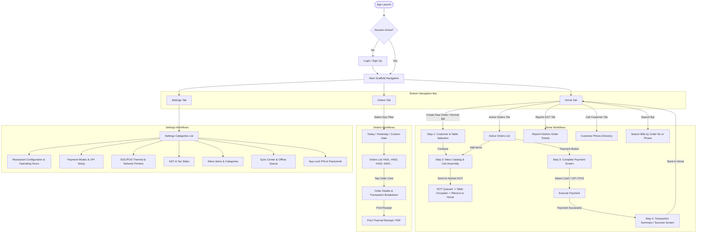

# 03 UI Navigation Map

This map outlines the verified screen navigation graph within KhanaBook Lite POS.

```mermaid
flowchart TD
    AppLaunch([App Launch]) --> CheckAuth{Session Active?}
    CheckAuth -- No --> Login[Login / Sign Up]
    Login --> MainScaffold
    CheckAuth -- Yes --> MainScaffold[Main Scaffold Navigation]

    subgraph MainBottomBar [Bottom Navigation Bar]
        HomeTab[Home Tab]
        OrdersTab[Orders Tab]
        SettingsTab[Settings Tab]
    end

    MainScaffold --> HomeTab
    MainScaffold --> OrdersTab
    MainScaffold --> SettingsTab

    subgraph HomeWorkflows [Home Workflows]
        HomeTab -->|Create New Order / Normal Bill| BillStep1[Step 1: Customer & Table Selection]
        BillStep1 -->|Continue| BillStep2[Step 2: Menu Catalog & Cart Assembly]
        BillStep2 -->|Send to Kitchen KOT| KOTFired[KOT Queued -> Table Occupied -> Returns to Home]
        
        HomeTab -->|Active Orders Tile| ActiveOrdersScreen[Active Orders List]
        ActiveOrdersScreen -->|Payment Button| BillStep3[Step 3: Complete Payment Screen]
        ActiveOrdersScreen -->|Add Items| BillStep2
        
        BillStep3 -->|Select Cash / UPI / POS| ProcessPayment[Execute Payment]
        ProcessPayment -->|Payment Successful| BillStep4[Step 4: Transaction Summary / Success Screen]
        BillStep4 -->|Back to Home| HomeTab
        
        HomeTab -->|Reprint KOT Tile| ReprintKotScreen[Reprint Kitchen Order Tickets]
        HomeTab -->|Call Customer Tile| CallCustomerScreen[Customer Phone Directory]
        HomeTab -->|Search Bar| SearchScreen[Search Bills by Order No or Phone]
    end

    subgraph OrdersWorkflows [Orders Workflows]
        OrdersTab -->|Select Day Filter| DayFilter[Today / Yesterday / Custom Date]
        DayFilter --> OrderList[Orders List #A01, #A02, #A03, #A04...]
        OrderList -->|Tap Order Card| OrderDetailsDialog[Order Details & Transaction Breakdown]
        OrderDetailsDialog -->|Print Receipt| ReceiptPrinted[Print Thermal Receipt / PDF]
    end

    subgraph SettingsWorkflows [Settings Workflows]
        SettingsTab --> SettingsHome[Settings Categories List]
        SettingsHome --> ShopConfig[Restaurant Configuration & Operating Hours]
        SettingsHome --> PaymentConfig[Payment Modes & UPI Setup]
        SettingsHome --> PrinterConfig[ESC/POS Thermal & Network Printers]
        SettingsHome --> TaxConfig[GST & Tax Slabs]
        SettingsHome --> MenuConfig[Menu Items & Categories]
        SettingsHome --> SyncCenter[Sync Center & Offline Queue]
        SettingsHome --> SecurityConfig[App Lock PIN & Passwords]
    end
```
