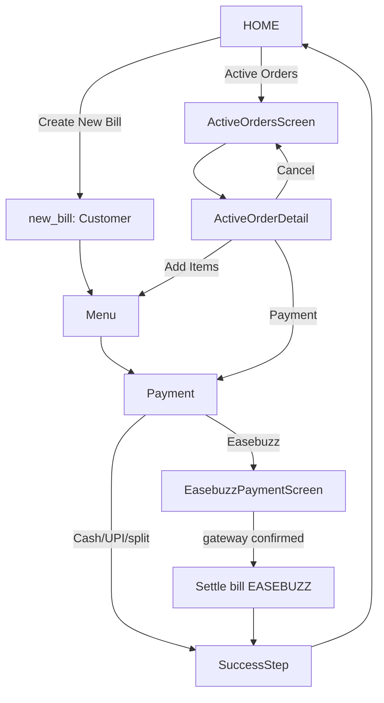

# KhanaBook — End-to-End Application Flow & Wiring Audit

**Date:** 2026-08-17 · **Scope:** Android POS app (`Android/app/src/main/java/com/khanabook/lite/pos`) · **Method:** read-only code trace (no changes made) · **Related docs:** `KHANABOOK_PRODUCTION_RELIABILITY_AUDIT_2026-08-17.md`, `KHANABOOK_EASEBUZZ_ERA_QA_2026-08-17.md`

---

## 1. Executive Summary

**The answer to the central question: the problems are dominated by application-level wiring/navigation/state architecture, not by defects inside individual screens.**

Individual screens are generally well built: they have loading/error/empty states, offline-safe repositories, and careful money-path validation. But the *connections between them* are ad-hoc and inconsistent, and several features that "work" in isolation fail end-to-end. Concretely:

1. **P0 — Easebuzz money can never be finalized locally.** The Easebuzz SDK payment succeeds at the gateway, the app shows "Payment Successful", but the local settlement path is rejected by the domain validator: `PaymentSetValidator.supportedModes = {cash, upi, pos}` (PaymentSetValidator.kt:20) does not include `easebuzz`. Every Easebuzz success ends in `settleDraftOrder(EASEBUZZ)` → `finalizeOnlineBillAtomically` → `Unsupported payment mode: easebuzz` → the user is bounced back to the menu step with *"Payment succeeded on the gateway, but the order could not be finalized locally."* The bill stays `DRAFT + PENDING` locally even though the customer paid. This is a textbook **"function works, flow is wrong"** defect — the feature was wired into the UI (enum, profile flag, payment-mode picker, SDK screen) but the domain layer was never updated in lockstep.

2. **P1 — Payment returns are modeled as global state with multiple collectors.** `PaymentReturnManager.latestEvent` is a `StateFlow` observed simultaneously by (a) a global collector in `MainActivity` that navigates to `new_bill?resumePayment=true` from *any* screen except `new_bill`, (b) `PaymentStep`, and (c) `EasebuzzPaymentScreen` — with a hand-written `sdkResultHandled` flag to arbitrate. This produces surprising auto-navigation (e.g. `new_bill` pushed on top of the Easebuzz result screen) and stale back-stack entries.

3. **P1 — Dead code is everywhere and looks live.** Five nav routes are never navigated to (`order_status`, `notifications`, `marketplace_orders`, `staff_permissions`, `background_reliability`); the Home notification bell is wired to a no-op; the Settings "Notifications" and "Marketplace Orders" entries open a **blank screen** (no section branch exists); and an entire duplicate payment screen (`ActiveOrderScreen.kt`) is unreferenced. This makes the real wiring hard to audit and easy to break.

4. **P1 — Back-stack hygiene is inconsistent.** "Back to Home" from the billing flow uses `popUpTo(new_bill) { inclusive }` + `navigate(main/0)` without `launchSingleTop`, leaving `active_orders` / `active_order_detail` / `easebuzz_payment` entries below the new `main/0`. Duplicate `main/0` entries and hidden stale screens accumulate.

5. **P1/P2 — Multiple parallel code paths implement the same business action.** Bill creation exists as `completeOrder` (direct), `createDraftOnlineBill` → `finalizeOnlineBill` (UPI/Easebuzz), `saveDraftOrder` (table orders), and `settleDraftOrder` — each independently duplicating invoice allocation, daily-counter increment, and payment-set building. The Easebuzz launch block is copy-pasted twice in `PaymentStep`.

---

## 2. Application Architecture Map

```
MainActivity (FragmentActivity, singleTask, portrait)
 └─ KhanaBookLiteTheme
     └─ NavHost (startDestination = "splash", 21 routes)
         ├─ Auth gate: splash → login/signup → authenticatedStartDestination()
         │    (role_access → initial_sync → quick_start → main/0)
         ├─ main/{tab}?source&highlightBillId&section   ← the 4-tab shell
         │    ├─ Home    → HomeScreen            (HomeViewModel, NotificationViewModel)
         │    ├─ Reports → ReportsScreen         (ReportsViewModel)
         │    ├─ Orders  → OrdersScreen          (ReportsViewModel, BillingViewModel)
         │    └─ Profile → SettingsScreen        (SettingsViewModel, AuthViewModel)
         ├─ new_bill?resumePayment&draftBillId&targetStep  (BillingViewModel, MenuViewModel)
         │    ├─ CustomerInfoStep → MenuSelectionStep → PaymentStep → SuccessStep/FailedStep
         ├─ active_orders / active_order_detail/{billId}
         ├─ easebuzz_payment/{billId}/{restaurantId}   (EasebuzzPaymentViewModel)
         └─ search_bill / call_customer / reprint_kds / ocr_scanner/{source}
```

**Layers:**
- **UI:** Compose screens in `ui/screens/**` (+ `ui/designsystem`, `ui/theme`, `ui/gesture`, `ui/feedback`).
- **ViewModels:** `ui/viewmodel/**` — Billing, Home, Reports, ActiveOrders, ActiveOrderDetail, Auth, Settings, Menu, Search, EasebuzzPayment, InitialSync, Splash, Notification, MarketplaceOrder, StaffPermission, AppLock, Logout, UserManagement, QuickStart.
- **Domain:** `domain/manager/**` (PaymentModeManager, PaymentSetValidator, BillCalculator, OrderIdManager, PrintRouter, SyncManager, SessionManager, PaymentReturnManager, …) and `domain/model` (Enums: OrderStatus, PaymentStatus, PaymentMode).
- **Data:** Room (`data/local` — 67-schema DB, per-restaurant tenant DAOs), Retrofit (`data/remote`), repositories (`data/repository`).
- **Background:** `worker/**` — MasterSyncWorker, FCM, BootReceiver; `PrintService` foreground service.

**Deep link (only one):** `khanabook://payment/{success|failure}` → `MainActivity.onNewIntent/onCreate` → `PaymentReturnManager.handleIntent` → `latestEvent`/`events`.

---

## 3. Screen Inventory (21 destinations + 1 dead screen)

| Route | Screen | Entry | Back target | Notes |
|---|---|---|---|---|
| `splash` | SplashScreen | always | — | VM decides login/main/app_lock |
| `login` | LoginScreen | splash, session expiry, logout, app_lock recover | — | state-driven `onLoginSuccess` |
| `signup` | SignUpScreen | login | popBackStack → login | |
| `app_lock` | AppLockScreen | splash, MainActivity ON_RESUME | popBackStack | auto-unlock on PIN |
| `role_access` | RoleAccessScreen | `authenticatedStartDestination()` | login | non-POS roles |
| `initial_sync` | InitialSyncScreen | splash when !syncCompleted | quick_start / main / login | state-driven |
| `quick_start` | QuickStartScreen | initial_sync | main | |
| `background_reliability` | BackgroundReliabilityScreen | **never** | — | **orphaned route** |
| `main/{tab}…` | MainScreen | everywhere | Home tab (BackHandler) → double-back exit | 4 tabs |
| `new_bill…` | NewBillScreen | main, active_orders, active_order_detail, global payment-return collector | step-wise back; exit → popBackStack or main/0 | 3-step + result |
| `ocr_scanner/{source}` | OcrScannerScreen | Settings menu-config, barcode in billing | popBackStack | |
| `search_bill` | SearchScreen | Home "Find Bill" | popBackStack | |
| `order_status` | SearchScreen | **never** | — | **orphaned route** |
| `active_orders` | ActiveOrdersScreen | Home "Active Orders" | popBackStack | |
| `active_order_detail/{billId}` | ActiveOrderDetailScreen | active_orders, Home | popBackStack | |
| `call_customer` | CallCustomerScreen | Home | popBackStack | |
| `reprint_kds` | ReprintKdsScreen | Home | popBackStack | |
| `notifications` | NotificationsScreen | **never** | — | **orphaned route** (Settings entry shows blank screen instead) |
| `staff_permissions` | StaffPermissionScreen | **never (as route)** | — | rendered inline from Settings section instead |
| `marketplace_orders` | MarketplaceOrdersScreen | **never** | — | **orphaned route** (Settings entry shows blank screen) |
| `easebuzz_payment/{billId}/{restaurantId}` | EasebuzzPaymentScreen | PaymentStep "Pay Online" | main/0 on success | SDK launch |

**Dead screen not in nav graph:** `screens/ActiveOrderScreen.kt` (a full duplicate of draft-edit + payment + settle with its own QR generation) — never referenced anywhere.

---

## 4. Navigation Inventory — every user action → destination

| Source | Action | Handler | Destination | Expected | Problem |
|---|---|---|---|---|---|
| Home | Create New Bill | `onNewBill` | `new_bill` | same | — |
| Home | Active Orders | `onActiveOrder` | `active_orders` | same | — |
| Home | Find Bill / Reprint KOT / Call Customer | callbacks | search_bill / reprint_kds / call_customer | same | — |
| Home | Notification bell | `onOpenNotifications` = `{}` | **nothing** | notifications | **dead button** (AppNavGraph never passes a real callback) |
| Home | Unresolved Payment → Resume | `onResumePendingPayment` | `new_bill?resumePayment=true` | payment resume | OK |
| Home | Unresolved Payment → Cancel | `viewModel.cancelPendingOnlinePayment` | stays | stays | OK |
| Home | Sync quarantine → Open | `onOpenSyncCenter` | `main/3?section=sync_center` | sync center | OK (tab remap) |
| Orders tab row (DRAFT) | tap row | `navController.navigate("new_bill?draftBillId=…&targetStep=2")` | new_bill | — | **unreachable**: DRAFT rows are filtered out of `visibleRows` (OrdersScreen.kt) |
| Orders tab row | tap row | `selectedBillId` + dialog | dialog | same | — |
| Orders tab | Resume draft (dialog) | `onResumeDraft` → navigate new_bill | new_bill | — | dialog only reachable for non-draft rows; branch effectively dead |
| ActiveOrders | Open order | `onOpenActiveOrder` | `active_order_detail/{id}` | same | — |
| ActiveOrders | Payment | `onCollectPayment` | `new_bill?draftBillId=…&targetStep=3` | payment step | back-stack pollution (see §9) |
| ActiveOrderDetail | Add Items | navigate `new_bill?draftBillId&targetStep=2` | new_bill menu step | same | pushes 3rd billing entry on stack |
| ActiveOrderDetail | Payment | navigate `new_bill?draftBillId&targetStep=3` | payment step | same | stack: main→active_orders→detail→new_bill |
| CustomerStep | Open draft (Add/Settle) | `onOpenDraftOrder` → navigate new_bill | new_bill | — | pushes **another** new_bill on top of the current one |
| NewBill step 3 | Pay Online (EASEBUZZ mode) | `onPayOnline(serverBillId, restaurantId)` | easebuzz_payment | same | plus global collector immediately pushes new_bill on top (see §5/G9) |
| NewBill step 3 | Pay Online (separate button) | same handler | easebuzz_payment | same | **duplicated 15-line serverId-wait block** copy-pasted |
| NewBill success | Back to Home | `navigateToHome` | `main/0` popUpTo new_bill | home | stale entries below (see §9) |
| NewBill success | (from draft/edit) | `returnToCompletedOrders` | `main/3?source=ALL&highlightBillId` | Orders tab w/ highlight | user lands on a *different tab* than they started on |
| Easebuzz | Done (success) | `onPaymentComplete` | `main/0` popUpTo easebuzz | home | **no launchSingleTop** → duplicate main/0; finalization actually happens later via resume path |
| Settings | Notifications | `onSelectItem("notifications")` | **blank screen** | notifications | SettingsScreen `when(section)` has no such branch → empty body titled "Profile" |
| Settings | Marketplace Orders | `onSelectItem("marketplace_orders")` | **blank screen** | marketplace | same |
| Settings | Staff Permissions | inline render | inline | same | nav route `staff_permissions` orphaned |
| Any screen | Payment return event | `MainActivity` collector | `new_bill?resumePayment=true` | (nothing) | **global state→navigation**, see G9 |
| Any screen | session expired / user null | MainActivity observers | `login` popUpTo(0) | login | OK |
| App background | lock enabled | MainActivity ON_RESUME | `app_lock` | lock | OK |

---

## 5. Key Flow Traces (as implemented)

### 5.1 New Bill (fresh, cash/UPI)
```
Home ──"Create New Bill"──▶ new_bill (step 1 Customer)
  ▶ step 2 Menu ▶ step 3 Payment
     ├─ CASH: tap "Payment Successful" → completeOrder() → COMPLETED/SUCCESS → step 4 Success
     └─ UPI (new bill): LaunchedEffect auto-creates DRAFT+PENDING bill (payment_mode=upi),
        QR shown; tap "Payment Successful" → finalizeOnlineBill(id) → step 4 Success
  ▶ "Back to Home" → navigate main/0 popUpTo new_bill inclusive, launchSingleTop
```

### 5.2 Easebuzz (as implemented — broken at finalization)
```
PaymentStep (mode EASEBUZZ or separate button)
  ▶ createDraftOnlineBill()  (bill.paymentMode still defaults to "upi" — setPaymentMode
    for EASEBUZZ is only called AFTER this branch, so the draft is mislabeled)
  ▶ triggerSyncAndWait → poll serverId ×5 → onPayOnline(serverBillId, restaurantId)
  ▶ easebuzz_payment: createOrder → PWECheckoutActivity (SDK)
  ▶ SDK success → PaymentReturnManager.latestEvent = SUCCESS(txn)
     ├─ EasebuzzPaymentViewModel: PaymentSuccess state ("Payment Successful!" + Done)
     ├─ MainActivity collector (route != new_bill) → navigate("new_bill?resumePayment=true")
     │    → new_bill becomes top of stack (Easebuzz screen now hidden)
     └─ PaymentStep observer → settleDraftOrder(EASEBUZZ)
          → buildPaymentEntities → PaymentMode "easebuzz"
          → finalizeOnlineBillAtomically → PaymentSetValidator.validate
          → require(mode in {cash,upi,pos})  ✗ THROWS "Unsupported payment mode: easebuzz"
          → reportError → onBackToMenu()  ← user bounced back to menu step
  Bill remains DRAFT+PENDING locally. Money captured at gateway. ✗
```

### 5.3 Draft/table order
```
Home ▶ active_orders ▶ active_order_detail/{id}
  ├─ Add Items → new_bill?draftBillId&targetStep=2 → appendItemsToDraft → "Update Table" → returnToNewBillTables → main/3 (Orders tab)
  ├─ Payment → new_bill?draftBillId&targetStep=3 → settleDraftOrder → SuccessStep → main/0
  └─ Cancel → cancelOrder → onBack
```

### 5.4 Initial sync / onboarding
```
splash → authenticatedStartDestination():
  !canUsePos → role_access
  !initialSync → initial_sync → (Success) → quick_start? → main/0
  pinLocked → app_lock
```

---

## 6. Expected Flow Map (recommended logical flow)



Key expectations the current implementation violates:
- Payment return must finalize the bill on the **billing screen that initiated it** — no global navigation from arbitrary screens.
- The Easebuzz result screen must be the terminal screen of the payment flow (its Done button should be the only exit), or the auto-resume must be explicit and not layered on top.
- "Back to Home" must collapse the stack to a single `main/0` regardless of entry path.
- Settings entries that render a screen must render it; entries with no screen must not exist.

---

## 7. Business State Machine (bill lifecycle, as implemented)

```
                 completeOrder()                    createDraftOnlineBill() / saveDraftOrder()
   ┌───────────────────────────────┐                ┌────────────────────────────────┐
   ▼                               │                ▼                                │
[No record] ─────────────▶ COMPLETED/SUCCESS      DRAFT + PENDING ──────────────┐    │
   (direct bill)                  (or CANCELLED/FAILED)                       │    │
                                                                               ▼    │
                                    finalizeOnlineBill / settleDraftOrder ──▶ COMPLETED/SUCCESS
                                    (reject if not DRAFT+PENDING)             (or cancelOrder → CANCELLED)
```

- **Writers:** BillingViewModel (completeOrder, createDraftOnlineBill, finalizeOnlineBill, settleDraftOrder, recoverPartialDraftPayment, finalizeRecoveredPaymentSet), ActiveOrderDetailViewModel (cancelOrder), OrdersScreen → ReportsViewModel (updateOrderStatus, cancelOrder, updatePaymentMode), HomeViewModel (cancelPendingOnlinePayment), sync pull (server state), PrintService (no state).
- **Persistence:** Room `bills` table; survives restart; offline-safe (all creation paths are local-first, sync triggered after).
- **Single-source-of-truth weakness:** `finalizeOnlineBillAtomically` (BillDao.kt:535) is the *good* choke point (terminal ownership, payment-set validation, idempotent retry, inventory boundary). But `completeOrder` does **not** route through it — it inserts a COMPLETED bill directly, duplicating invoice/counter/validation logic. Two parallel finalization paths = drift risk (this is exactly how EASEBUZZ fell out of sync: the new mode was added to the UI + one manager, but not to the validator used by the choke point).

---

## 8. Payment Lifecycle Analysis

**Modes:** CASH, UPI, POS, EASEBUZZ, PART_CASH_UPI, PART_CASH_POS, PART_UPI_POS (Enums.kt).

| Aspect | Finding | Severity |
|---|---|---|
| Easebuzz local finalization | **Impossible** — `PaymentSetValidator.supportedModes = {cash,upi,pos}` rejects `easebuzz` | **P0** |
| Easebuzz draft mislabel | For a new bill, the draft is created before `setPaymentMode(EASEBUZZ)` is applied → draft recorded with default `upi` (mislabeled; also makes the draft visible in Home "Unresolved Payment" + UPI-keyed resume queries) | P1 |
| One-shot event modeling | `PaymentReturnManager.latestEvent` is a StateFlow; PaymentStep observer "fires on initial value AND changes" — a stale event present at composition auto-settles without a fresh payment; txnId is ignored when choosing which bill to settle (settles `editingBillId`) | P1 |
| Multiple collectors of same event | MainActivity (navigates), PaymentStep (settles), EasebuzzPaymentScreen (guarded by `sdkResultHandled`) — ownership is implicit and fragile | P1 |
| Recovery path | `getPaymentRecoveryAssessment`/`assessForRecovery` also restrict to cash/upi/pos → any easebuzz row → `Conflicting` | P1 |
| Split modes | UPI cap auto-split (₹1L) well handled; validated by PaymentSetValidator as multi-mode sets | OK |
| Double-charge / idempotency | `finalizeOnlineBillAtomically` has careful constraint-recovery; server-side concerns in the reliability audit doc | OK (local) |
| Payment mode recorded | Finalization rewrites `bills.payment_mode` from the payment set (BillDao.kt:629-636) — correct *if* validation passes | — |

---

## 9. Back-Stack Analysis

| Flow | Stack after action | Problem |
|---|---|---|
| Home → new_bill → Success → "Back to Home" | `[main/0]` | OK (clean) |
| Home → active_orders → detail → new_bill(settle) → Success → "Back to Home" | `[main/0, active_orders, active_order_detail, main/0]` | **stale entries below**; duplicate main/0 |
| Home → active_orders → Payment → new_bill → Success → Back | `[main/0, active_orders, main/0]` | stale `active_orders` |
| Home → new_bill → Easebuzz → SDK success | `[main/0, easebuzz, new_bill]` (collector pushes new_bill on top) | Easebuzz screen hidden; its "Done" button is now buried |
| … → SuccessStep → Back to Home | `[main/0, easebuzz, main/0]` | stale `easebuzz` entry |
| Easebuzz Done (if reached) | `navigate("main/0")` **without launchSingleTop** | duplicate main/0 |
| Settings → sections | local `section` state, no nav stack | OK |
| App lock | pushed; popBackStack on unlock | OK |
| Session expiry / logout | `popUpTo(0) inclusive` → login | OK (clean wipe) |

**Root causes:** (1) "Back to Home" pops only the `new_bill` entry, never the rest of the flow; (2) `launchSingleTop` is used inconsistently (present in new_bill's `navigateToHome`, absent in easebuzz's `onPaymentComplete`); (3) the global payment-return collector pushes `new_bill` from arbitrary stacks.

---

## 10. State-vs-Event Analysis

**Patterns found (state used as navigation event):**

| Location | Pattern | Risk |
|---|---|---|
| MainActivity | `PaymentReturnManager.latestEvent.collect { if (event != null && route !startsWith "new_bill") navigate(new_bill?resumePayment=true) }` | **Highest risk** — fires from any screen incl. easebuzz screen |
| MainActivity | `currentUser == null` → navigate login; `isSessionExpired` → navigate login | Correct as guards, but implicit |
| PaymentStep | `snapshotFlow { latestPaymentEvent }.collect { settle + onComplete() }` — "fires on initial value AND changes" | Stale-event auto-settle |
| PaymentStep | `LaunchedEffect(paymentRecovery, editingBillId)` → auto-`finalizeRecoveredPaymentSet` → `onComplete()` | Automatic navigation on state change |
| PaymentStep | `LaunchedEffect(canGenerateAmountQr, …)` → `createDraftOnlineBill()` | Side-effect (bill creation) triggered by UI-state derivation |
| EasebuzzPaymentScreen | `LaunchedEffect(state)` → launch SDK activity | Auto side-effect on state |
| LoginScreen / InitialSync / Splash | `LaunchedEffect(loginStatus/syncState/state)` → navigate | Standard, but means login state is a *persistent* StateFlow used as a one-shot — re-entry after state change re-fires navigation (mitigated by popUpTo) |
| AppLockScreen | `LaunchedEffect(enteredPin)` → auto-unlock | Intentional |

**Missing one-shot discipline:** there is no `Channel`/`SharedFlow(replay=0)` used for navigation anywhere; all navigation signals are StateFlows. The one place a SharedFlow exists (`PaymentReturnManager.events`) is never consumed for navigation — only `latestEvent` is.

---

## 11. Offline-First Analysis

- **Good:** bill creation (all 3 paths), draft save, settle, QR generation, print queueing are local-first; sync is triggered post-hoc (`syncManager.triggerImmediateSync()`); the app never blocks billing on network.
- **Easebuzz is (correctly) network-dependent:** `Pay Online` requires `serverId`; offline it shows *"Bill sync pending. Please wait and try again."* — acceptable, but the *rest of the bill* was already created locally as DRAFT before this check, so an offline cashier who taps Pay Online leaves a stray draft behind.
- **Problem:** the payment-return navigation in MainActivity depends on `sessionManager.canUsePos()` but **not** on the network — it fires regardless, which is right for offline UPI resume, but it is also the source of the surprise-navigation bug.
- **DB as source of truth:** yes — Room is the source of truth for billing; the server is reconciled via sync. The one place network results drive UI (Easebuzz order creation) is gated behind a dedicated screen. Consistent.

---

## 12. Current vs Expected — Gap Table

| # | Flow | Current Behavior | Expected Behavior | Sev |
|---|---|---|---|---|
| G1 | Easebuzz settle | Local finalization rejected by validator; bill stuck DRAFT+PENDING after gateway success; error bounce | Bill finalized COMPLETED/SUCCESS with `easebuzz` payment row | **P0** |
| G2 | Easebuzz draft mode | New-bill draft created with default `upi` mode (setPaymentMode applied after the branch) | Draft reflects selected EASEBUZZ mode from the start | P1 |
| G3 | Payment-return event | Global collector navigates to new_bill from any screen; 3 collectors + ownership flag | Single consumer in the billing flow; no global navigation | P1 |
| G4 | Back stack | Stale active_orders/detail/easebuzz entries + duplicate main/0 | Single main/0 on "Back to Home" | P1 |
| G5 | Dead routes | order_status, notifications, marketplace_orders, staff_permissions, background_reliability unreachable | Remove or wire them | P1 |
| G6 | Settings dead entries | "Notifications" / "Marketplace Orders" → blank screen | Render real screens (or remove entries) | P1 |
| G7 | Home bell | Notification bell does nothing | Open notifications | P1 |
| G8 | Dead screen | ActiveOrderScreen.kt (duplicate payment screen) unreferenced | Delete | P2 |
| G9 | Easebuzz entry points | Two code paths (EASEBUZZ mode + separate button) with duplicated serverId-wait logic | One path | P2 |
| G10 | Orders tab DRAFT | DRAFT rows filtered out, but row-click DRAFT branch + dialog "Resume draft" remain | Align UI with reachable states | P2 |
| G11 | Stale auto-drafts | Backing out of UPI payment leaves DRAFT+PENDING bill; Home shows "Unresolved Payment" until manual Cancel | Clean up on explicit exit | P2 |
| G12 | Pay-mode colors | Duplicate `getPayModeColor` (PaymentStep `else → Brown500`) vs `PaymentColors.getPayModeColor` (EASEBUZZ → blue); inconsistent | One color source | P2 |
| G13 | NewBill step persistence | `step` is `remember` (not saveable); `editingBillId` plain var — process death resets to initialStep/DB restore | Persist step + editing id | P2 |
| G14 | CustomerStep | `active_order` order-type branch unreachable (no button sets it) | Remove or wire | P3 |

---

## 13. Root-Cause Analysis

1. **RC1 — No single navigation authority.** Navigation is scattered: callbacks passed down from AppNavGraph (mostly good), but also `navController` handed *into* screens (NewBillScreen, MenuSelectionStep, OrdersScreen, MainScreen), plus two global collectors in MainActivity, plus VM-state-driven navigation in screens. There is no one place to reason about "what happens after payment".
2. **RC2 — One-shot events modeled as state.** `PaymentReturnManager.latestEvent` is a StateFlow; navigation and settlement both derive from it, with implicit ownership (who clears it, who handles it). The `sdkResultHandled` flag is a symptom of this ambiguity.
3. **RC3 — Parallel business paths + no lockstep.** Bill creation/finalization is duplicated across `completeOrder`, `createDraftOnlineBill`/`finalizeOnlineBill`, `saveDraftOrder`, `settleDraftOrder`. The single choke point (`finalizeOnlineBillAtomically` → `PaymentSetValidator`) was not updated when EASEBUZZ was added → the P0.
4. **RC4 — Dead code accumulates.** Orphaned routes, an orphaned screen, dead branches, and copy-pasted blocks make the intended wiring indistinguishable from the actual wiring and erode confidence.
5. **RC5 — Inconsistent back-stack strategy.** "Return home" is implemented per-screen with route-pattern `popUpTo`, inconsistent `launchSingleTop`, and no "pop to start destination" convention.

---

## 14. Recommended Architecture (minimum viable)

1. **Fix the money path (P0):** add `easebuzz` to `PaymentSetValidator.supportedModes` (both `validate` and `assessForRecovery`); verify `PaymentModeManager.getPaymentComponents` yields a single `easebuzz` component (it does); add a DB-level test that `finalizeOnlineBillAtomically` accepts an easebuzz set. **Also** set the payment mode *before* creating the draft in the Easebuzz button handler.
2. **Make payment-return consumption explicit (P1):** remove the global `MainActivity` collector. Keep the deep-link → `latestEvent` handoff, but consume it only inside `PaymentStep` (it already restores the pending bill on `resumePayment=true`). Use `events` (SharedFlow, replay=0) for settlement, and `latestEvent` only as the resume *signal* read once on entry.
3. **One Easebuzz entry point (P1/P2):** delete the separate "Pay Online (Easebuzz)" button path; keep the EASEBUZZ mode (or vice-versa), extracting the serverId-wait into one `BillingViewModel` function.
4. **Back-stack convention (P1):** "return to home" should be `popUpTo(navController.graph.findStartDestination().id) { inclusive = false }; navigate("main/0") { launchSingleTop = true }` everywhere; ensure `easebuzz` completion also uses `launchSingleTop`.
5. **Remove dead code (P1):** delete orphaned routes (`order_status`, `notifications`, `marketplace_orders`, `staff_permissions` route, `background_reliability`) or wire them; fix Settings sections + Home bell; delete `ActiveOrderScreen.kt`.
6. **Centralize finalization (P2):** route `completeOrder` through `finalizeOnlineBillAtomically` so there is exactly one validation/identity path.

---

## 15. Recommended Fix Order (low-risk rollout for a live café)

| Step | Change | Risk | Verify |
|---|---|---|---|
| 1 | `PaymentSetValidator` accepts `easebuzz` + set mode before draft creation | Low | Unit test; real Easebuzz payment on one terminal |
| 2 | Remove MainActivity global payment-return collector; consume event in PaymentStep only | Medium | Regression: UPI deep-link resume, Easebuzz resume after process death |
| 3 | Back-stack hygiene (`launchSingleTop`, pop-to-start on Back to Home) | Low | Manual: all entry paths end at single main/0 |
| 4 | Delete dead routes/screen; fix Settings entries + Home bell | Low | Compile + click-through |
| 5 | Consolidate Easebuzz entry points; single color source; persist step | Low | Manual billing smoke test |
| 6 | Route `completeOrder` through the atomic finalizer | Medium | Full billing regression |

Ship 1–3 together in one release (money + navigation safety); 4–6 in a cleanup release.

---

## 16. Tests Required to Prevent Regression

**Unit/DB (Room)**
- `PaymentSetValidator.validate` accepts `easebuzz` single-mode set for exact total; `assessForRecovery` classifies an easebuzz row.
- `finalizeOnlineBillAtomically` with an `easebuzz` payment → `FINALIZED_NOW`, bill `completed/success`, `payment_mode = easebuzz` (mirrors existing `BillDaoIsolationTest` cases).
- Idempotency: same easebuzz set re-finalized → `ALREADY_FINALIZED_IDEMPOTENT` (existing pattern).

**Navigation/flow**
- Publishing `khanabook://payment/success` while on a non-billing route does **not** navigate (after removing the global collector).
- All "Back to Home" paths end with a back stack containing exactly one `main/0`.
- Easebuzz Done button lands on Home with no duplicate `main/0`.
- New-bill step survives process death (step persisted or restored via `draftBillId`/`resumePayment` args).

**Existing coverage to extend:** `NavigationFlowTest.kt` (deep-link handling), `BillDaoIsolationTest.kt` (finalization idempotency) — both live in `app/src/androidTest`.

---

*No code changes were made during this audit. Findings G1–G14 are filed for review before any fix is implemented.*
