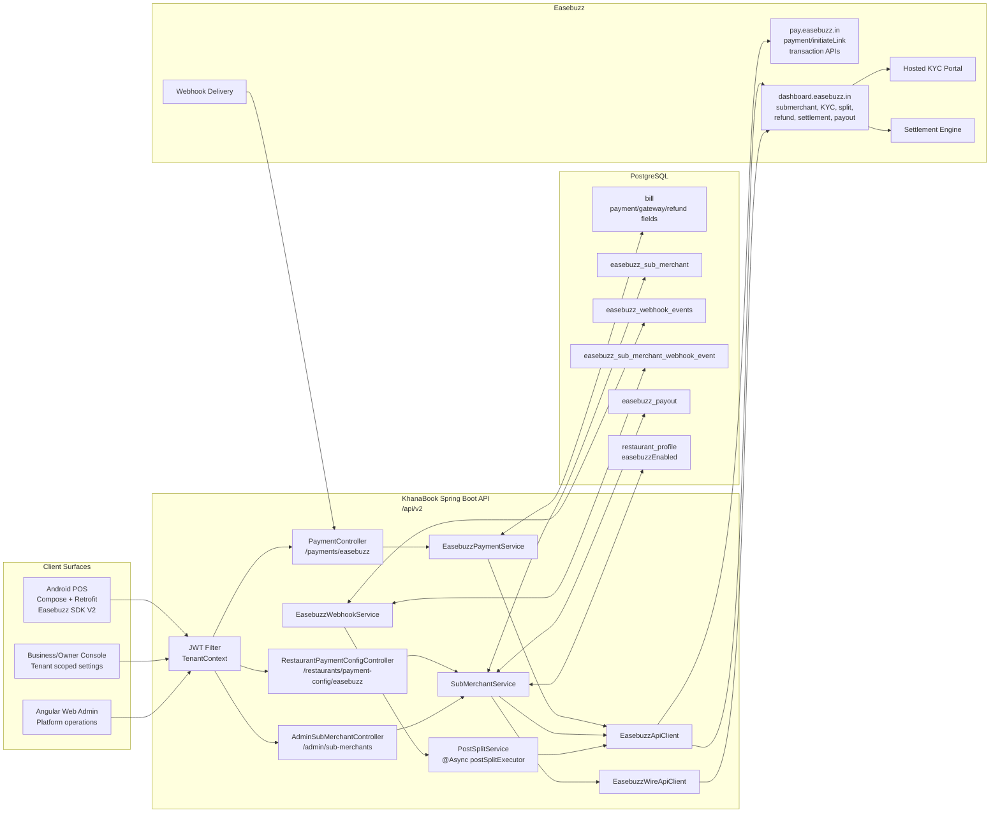
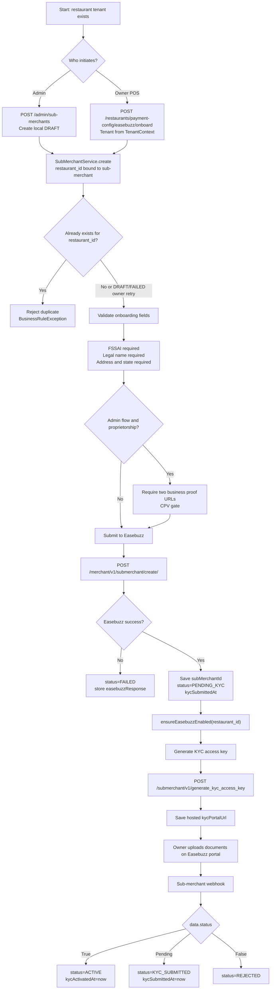
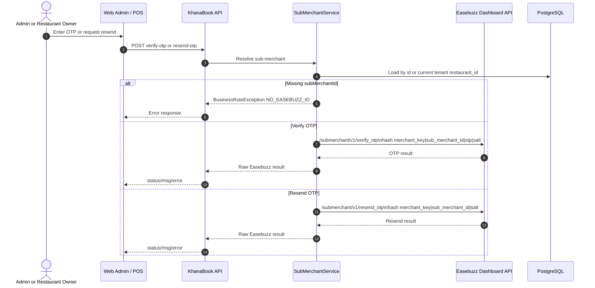
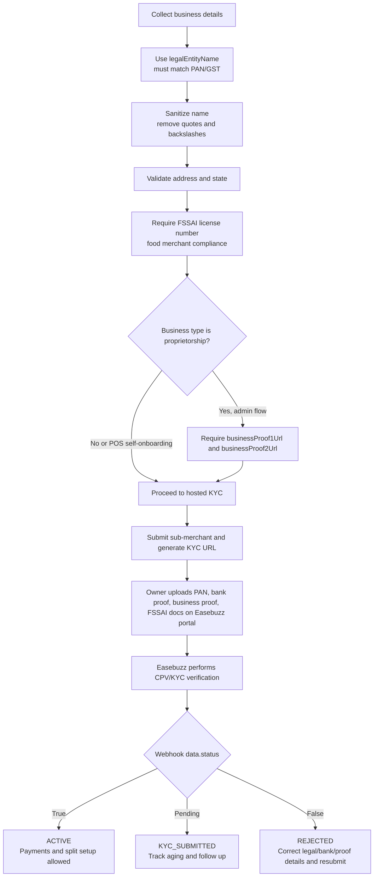
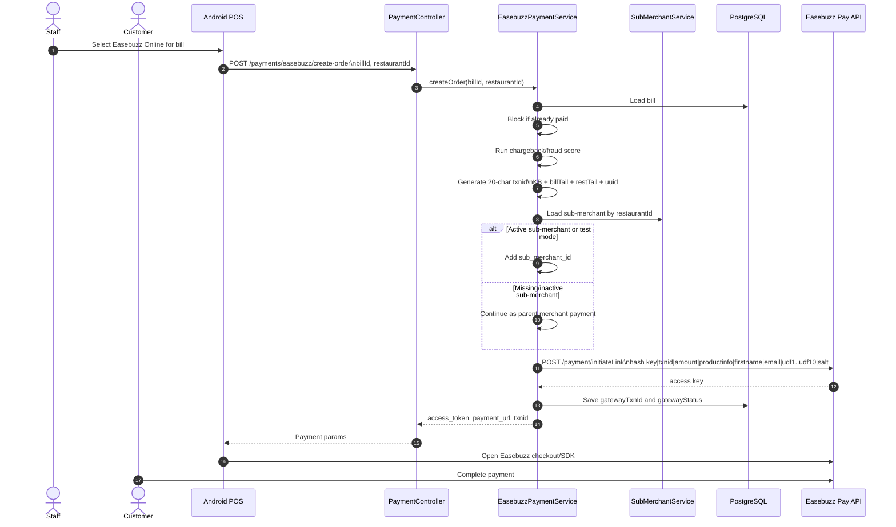
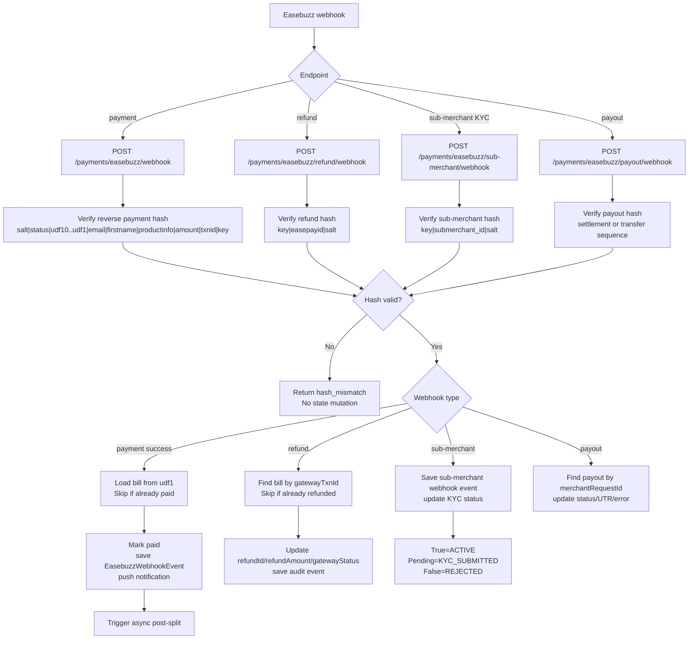
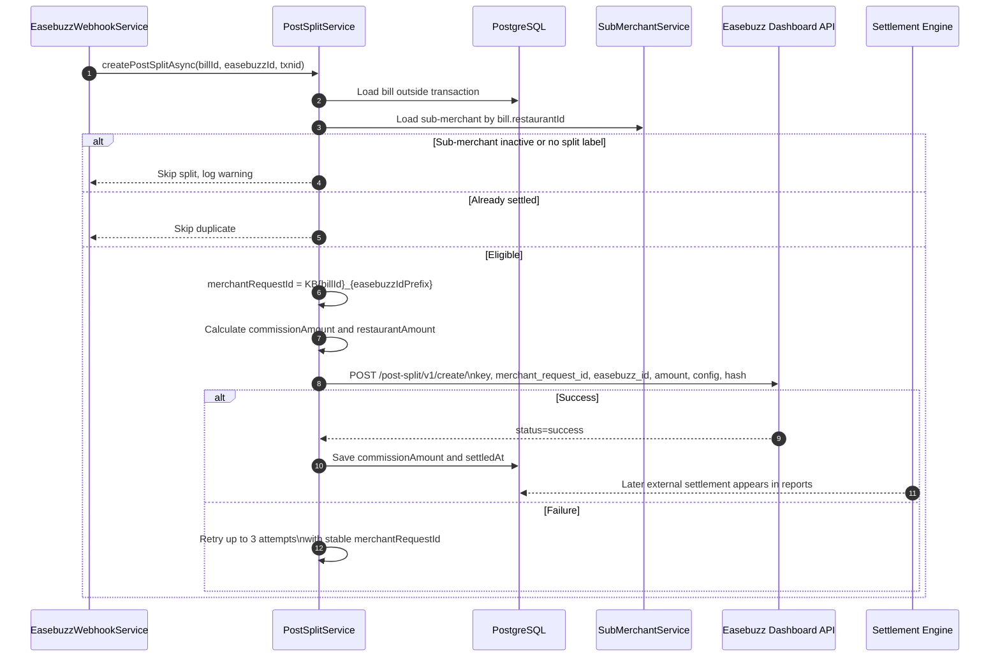
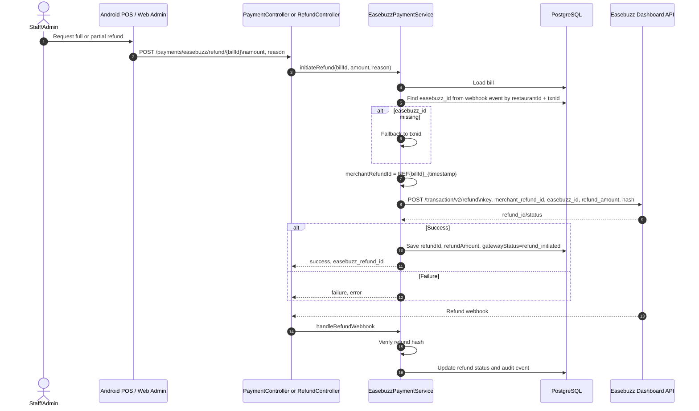
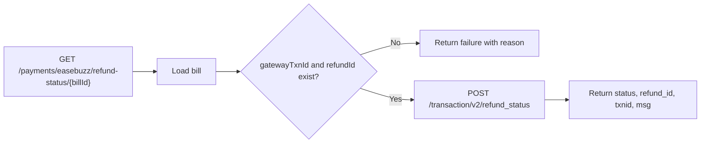
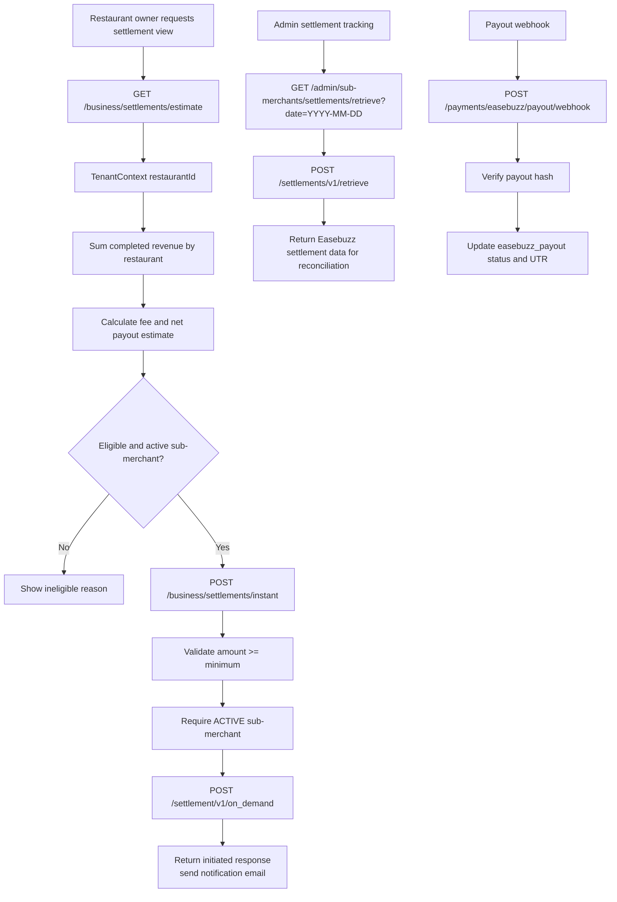

# KhanaBook Easebuzz Integration Review Package

Document date: 2026-06-17  
Branch reviewed: `v2`  
Scope: Easebuzz parent-submerchant marketplace model, tenant-isolated POS and admin architecture, KYC/CPV/OTP, payment, webhook, split settlement, refund, and settlement tracking flows.

## Executive Summary

KhanaBook v2 integrates Easebuzz as a marketplace payment layer. KhanaBook is the parent merchant. Each restaurant tenant is represented by one Easebuzz sub-merchant stored in `easebuzz_sub_merchant` and linked through `restaurant_id`.

Customer payments are initiated by the KhanaBook backend. If the restaurant has an Easebuzz sub-merchant ID and is `ACTIVE` (or running in test mode), the backend includes `sub_merchant_id` in the payment initiation request. After a successful payment webhook, KhanaBook marks the bill as paid, stores the Easebuzz transaction audit row, and starts an async post-transaction split that routes funds to the restaurant split label and KhanaBook commission label.

Core reviewed implementation files:

- `server/src/main/java/com/khanabook/saas/service/EasebuzzApiClient.java`
- `server/src/main/java/com/khanabook/saas/service/SubMerchantService.java`
- `server/src/main/java/com/khanabook/saas/service/EasebuzzPaymentService.java`
- `server/src/main/java/com/khanabook/saas/service/EasebuzzWebhookService.java`
- `server/src/main/java/com/khanabook/saas/service/PostSplitService.java`
- `server/src/main/java/com/khanabook/saas/webadmin/controller/AdminSubMerchantController.java`
- `server/src/main/java/com/khanabook/saas/webadmin/controller/RestaurantPaymentConfigController.java`
- `server/src/main/java/com/khanabook/saas/controller/PaymentController.java`
- `Android/app/src/main/java/com/khanabook/lite/pos/data/remote/api/KhanaBookApi.kt`
- `Android/app/src/main/java/com/khanabook/lite/pos/data/remote/dto/EasebuzzPaymentDtos.kt`

---

## 1. System Architecture Diagram



### Architecture Notes

| Layer | Responsibility |
|---|---|
| Android POS | Owner/staff payment initiation, payment status, refund status, onboarding and KYC actions. |
| Web Admin | Platform-level sub-merchant creation, update, KYC, OTP, split label, payout, settlement, and WIRE operations. |
| Spring Boot API | Owns all Easebuzz credentials, hash generation, webhook verification, tenant isolation, persistence, and retries. |
| PostgreSQL | Stores tenant-scoped sub-merchant records, bill gateway status, webhook audit rows, payout records, and restaurant payment enablement. |
| Easebuzz | Payment collection, hosted KYC, sub-merchant lifecycle, split labels, post-split, refunds, payout, and settlement. |

---

## 2. End-to-End Sequence Diagram

```mermaid
sequenceDiagram
    autonumber
    actor Admin as KbookAdmin
    actor Owner as Restaurant Owner
    actor Staff as POS Staff
    actor Customer
    participant POS as Android POS
    participant API as KhanaBook API
    participant DB as PostgreSQL
    participant EB as Easebuzz
    participant KYC as Easebuzz KYC Portal
    participant SET as Easebuzz Settlement

    Admin->>API: Create sub-merchant draft
    API->>DB: Insert easebuzz_sub_merchant(DRAFT, restaurant_id)
    Admin->>API: Submit to Easebuzz
    API->>EB: Create sub-merchant
    EB-->>API: submerchant_id
    API->>DB: status=PENDING_KYC, save subMerchantId
    Admin->>API: Generate KYC access key
    API->>EB: generate_kyc_access_key
    EB-->>API: hosted KYC URL
    API->>DB: Save kycPortalUrl
    Owner->>KYC: Upload KYC/CPV documents
    EB-->>API: Sub-merchant webhook
    API->>DB: status=ACTIVE or REJECTED or KYC_SUBMITTED
    Admin->>API: Create split label
    API->>EB: split/v1/create label sm_{sub_merchant_id}
    API->>DB: Save splitLabel
    Staff->>POS: Start online payment
    POS->>API: create-order billId, restaurantId
    API->>DB: Load bill and active sub-merchant
    API->>EB: payment/initiateLink with sub_merchant_id
    EB-->>API: access token/payment URL
    API->>DB: Save gatewayTxnId and gatewayStatus
    API-->>POS: access_token, txnid, amount
    Customer->>EB: Pay using checkout/SDK
    EB-->>API: Payment webhook
    API->>API: Verify hash and idempotency
    API->>DB: Mark bill paid; save webhook event
    API->>EB: post-split/v1/create
    EB-->>API: Split accepted or failed
    API->>DB: Save commissionAmount and settledAt on success
    SET-->>Owner: Bank settlement to restaurant
    SET-->>Admin: Commission settlement to parent
```

---

## 3. Onboarding and KYC Flow



### Local Status Mapping

| Local status | Meaning | Next expected action |
|---|---|---|
| `DRAFT` | Local record only. | Submit to Easebuzz. |
| `FAILED` | Last Easebuzz create/update failed. | Correct data and resubmit. |
| `PENDING_KYC` | Sub-merchant ID exists; KYC URL can be generated. | Owner uploads KYC documents. |
| `KYC_SUBMITTED` | Easebuzz has reported pending/review state. | Wait for CPV/KYC result. |
| `ACTIVE` | KYC approved. | Create split label, accept payments. |
| `REJECTED` | KYC/CPV failed. | Correct legal/bank/business proof data and resubmit. |

---

## 4. OTP Verification Flow



### OTP Entry Points

| Surface | Endpoint |
|---|---|
| Admin | `POST /api/v2/admin/sub-merchants/{id}/verify-otp` |
| Admin | `POST /api/v2/admin/sub-merchants/{id}/resend-otp` |
| Owner/POS | `POST /api/v2/restaurants/payment-config/easebuzz/verify-otp` |
| Owner/POS | `POST /api/v2/restaurants/payment-config/easebuzz/resend-otp` |

---

## 5. CPV Verification Flow

CPV is handled by Easebuzz as part of sub-merchant KYC review. KhanaBook prepares CPV-compatible data before submission and consumes the final KYC/CPV result through the sub-merchant webhook.



### CPV Controls Already Present

| Control | Implementation |
|---|---|
| Legal name protection | `legalEntityName` is submitted as business name for CPV matching. |
| Display name separation | `businessName` can remain the merchant-facing display name. |
| Mandatory food merchant license | FSSAI number is required before submitting to Easebuzz. |
| Proprietorship proof gate | Admin flow requires two business proof documents for proprietorship entities. |
| Hosted document upload | POS flow does not collect documents directly; owner uploads to Easebuzz KYC portal. |
| KYC aging | Web admin tracks time since submission/creation for follow-up. |

---

## 6. Payment Initiation Flow



### Payment Hash Fields

KhanaBook computes the initiate-payment hash server-side with all ten UDF slots:

`key|txnid|amount|productinfo|firstname|email|udf1|udf2|udf3|udf4|udf5|udf6|udf7|udf8|udf9|udf10|salt`

`udf1` is the bill ID and `udf2` is the restaurant ID, which enables webhook-to-bill mapping while preserving tenant context.

---

## 7. Webhook Processing Flow



### Webhook Reliability Controls

| Control | Current behavior |
|---|---|
| Hash verification | Implemented for payment, refund, sub-merchant, and payout webhooks. |
| Constant-time comparison | Uses `MessageDigest.isEqual`. |
| Duplicate payment webhook | Skips bill mutation if already `paid`. |
| Duplicate refund webhook | Skips if already `refunded`. |
| Audit trail | Payment/refund events stored in `easebuzz_webhook_events`; KYC events stored in `easebuzz_sub_merchant_webhook_event`. |
| Retry executor | `WebhookRetryConfig` registers PAYMENT, SUB_MERCHANT, PAYOUT, and REFUND executors. |

---

## 8. Post-Split Settlement Flow



### Split Configuration

| Label | Amount source | Purpose |
|---|---|---|
| `sm_{sub_merchant_id}` | `totalAmount - commissionAmount` | Restaurant settlement. |
| `kb_commission` | `totalAmount * commissionRate / 100` | KhanaBook platform commission. |

### Idempotency

`merchant_request_id` is stable per transaction: `KB{billId}_{easebuzzIdPrefix}`. Replays use the same ID so Easebuzz can deduplicate. KhanaBook also skips post-split if `settledAt` and `commissionAmount` are already present.

---

## 9. Refund Flow



### Refund Status Polling



---

## 10. Settlement Tracking Flow



### Settlement Records

| Data | Storage |
|---|---|
| Bill payment state | `bill.paymentStatus`, `bill.gatewayStatus`, `bill.gatewayTxnId`, `bill.settledAmount` |
| Split completion | `bill.commissionAmount`, `bill.settledAt` |
| Webhook audit | `easebuzz_webhook_events` |
| Payout tracking | `easebuzz_payout` |
| Sub-merchant payout account | `easebuzz_sub_merchant` bank fields, masked in API output |

---

## 11. Production Readiness Checklist

### Environment and Secrets

- [ ] Production `easebuzz.payment-base-url` is `https://pay.easebuzz.in`.
- [ ] Production `easebuzz.dashboard-base-url` is `https://dashboard.easebuzz.in`.
- [ ] Production `easebuzz.wire-base-url` is correct if WIRE APIs are enabled.
- [ ] `EASEBUZZ_MERCHANT_KEY` is supplied by environment or secret manager.
- [ ] `EASEBUZZ_SALT` is supplied by environment or secret manager.
- [ ] `EASEBUZZ_WIRE_API_KEY` is supplied only if WIRE APIs are used.
- [ ] Return URL is the production HTTPS `/api/v2/payments/easebuzz/return`.
- [ ] Notify URL is the production HTTPS `/api/v2/payments/easebuzz/webhook`.
- [ ] No sandbox ngrok URL remains in production config.
- [ ] JWT secret, database password, and mail credentials are production secrets.

### Easebuzz Account Enablement

- [ ] Parent-submerchant marketplace model enabled.
- [ ] Sub-merchant create/update API enabled.
- [ ] Hosted KYC access key enabled for live account.
- [ ] OTP verify/resend enabled for live account.
- [ ] Split label API enabled.
- [ ] Post-transaction split create/retrieve enabled.
- [ ] Refund v2 and refund-status enabled.
- [ ] Cancel transaction enabled.
- [ ] Payout v2 enabled if instant payout is supported.
- [ ] On-demand settlement enabled if used.
- [ ] Webhook delivery configured for payment, refund, sub-merchant, and payout.

### API and Hash Verification

- [ ] Initiate payment hash verified against Easebuzz docs with all UDF positions.
- [ ] Transaction status V2.1 uses dashboard base URL.
- [ ] Refund v2 uses dashboard base URL and implemented hash sequence.
- [ ] Refund status hash verified.
- [ ] Sub-merchant create/update hash verified.
- [ ] KYC access key hash verified.
- [ ] OTP verify/resend hash verified.
- [ ] Split label hash verified.
- [ ] Post-split create/retrieve hashes verified.
- [ ] Payout and settlement hashes verified.

### Webhooks

- [ ] Payment webhook hash accepted with live payload.
- [ ] Refund webhook hash accepted with live payload.
- [ ] Sub-merchant webhook hash accepted with live payload.
- [ ] Payout webhook hash accepted with live payload.
- [ ] Duplicate payment webhook does not double-mark or double-split.
- [ ] Duplicate refund webhook does not double-refund.
- [ ] Failed webhook delivery is captured by retry job.
- [ ] Raw payload retention and masking policy approved.
- [ ] Load balancer/proxy preserves request body and form-encoded payloads.

### Tenant Isolation

- [ ] Owner POS onboarding uses `TenantContext`, not a client-supplied restaurant ID.
- [ ] Owner KYC access key, OTP verify, and resend resolve the sub-merchant from current tenant.
- [ ] Admin-only sub-merchant list and mutation routes require admin authority.
- [ ] Bill payment sync uses tenant-scoped repositories/services.
- [ ] Payouts and settlements are scoped to current tenant where owner-facing.
- [ ] `restaurant_id` is included on all payment audit records.

### Operational Readiness

- [ ] All 133 backend tests pass before release.
- [ ] Android `assembleRelease` or `compileReleaseKotlin` passes.
- [ ] Web admin production build passes.
- [ ] First live INR 1-10 payment tested end-to-end.
- [ ] Live payment webhook and transaction-status poll both update the bill correctly.
- [ ] Live split label created for at least one test restaurant.
- [ ] Live post-split verified before settlement cutoff.
- [ ] Live refund and refund-status verified.
- [ ] Settlement report reconciled against internal bill ledger.
- [ ] Alerting exists for post-split failure after 3 attempts.
- [ ] Admin runbook exists for KYC rejection, split failure, refund failure, and payout failure.

---

## 12. Compliance Checklist

### KYC and CPV

- [ ] Legal entity name is collected separately from display business name.
- [ ] Legal name submitted to Easebuzz matches PAN/GST records.
- [ ] FSSAI license number is mandatory for food merchants.
- [ ] Business address and state are mandatory before Easebuzz submission.
- [ ] Proprietorship admin onboarding requires two valid business proof documents.
- [ ] Hosted KYC URL is generated only after sub-merchant ID exists.
- [ ] KYC URLs are not logged with sensitive tokens in production logs.
- [ ] KYC rejection path supports correction and resubmission.
- [ ] KYC status aging is visible to operations.

### Data Protection

- [ ] Easebuzz salt is server-only and never sent to Android/web clients.
- [ ] Bank account number is masked in serialized sub-merchant responses.
- [ ] Full bank account data access is restricted to backend persistence and outbound Easebuzz calls.
- [ ] Raw webhook payloads are reviewed for PII retention.
- [ ] Logs do not print hash raw input containing salt.
- [ ] Access to `/admin/sub-merchants` is restricted to platform admin roles.
- [ ] Tenant data is never selected by client-provided tenant IDs for owner workflows.

### Payments and Settlement

- [ ] Already-paid bills cannot create new Easebuzz payment attempts.
- [ ] Fraud/chargeback score blocks critical-risk payment initiation.
- [ ] Webhook idempotency prevents duplicate state transitions.
- [ ] Post-split is skipped if already settled.
- [ ] Stable `merchant_request_id` is used for split retries.
- [ ] Refund amount validation exists in business refund flows.
- [ ] Settlement initiation requires active sub-merchant status.
- [ ] Settlement/payout webhook status is stored for audit.

### Audit and Monitoring

- [ ] Payment webhooks are stored in `easebuzz_webhook_events`.
- [ ] Sub-merchant webhooks are stored in `easebuzz_sub_merchant_webhook_event`.
- [ ] Payout records store request ID, payout ID, status, UTR, and errors.
- [ ] Production dashboards show payment success, refund, split failure, and KYC status.
- [ ] Operational support has access to transaction IDs, Easebuzz IDs, refund IDs, and split merchant request IDs.

---

## API Surface Summary

| KhanaBook endpoint | Purpose | Easebuzz API |
|---|---|---|
| `POST /api/v2/payments/easebuzz/create-order` | Initiate customer payment | `/payment/initiateLink` |
| `GET /api/v2/payments/easebuzz/status/{billId}` | Local or refreshed payment status | `/transaction/v2.1/retrieve` |
| `POST /api/v2/payments/easebuzz/verify/{billId}` | Force transaction verification | `/transaction/v2.1/retrieve` |
| `POST /api/v2/payments/easebuzz/refund/{billId}` | Initiate refund | `/transaction/v2/refund` |
| `GET /api/v2/payments/easebuzz/refund-status/{billId}` | Retrieve refund status | `/transaction/v2/refund_status` |
| `POST /api/v2/payments/easebuzz/cancel/{billId}` | Cancel pending transaction | `/transaction/v1/cancel` |
| `POST /api/v2/payments/easebuzz/webhook` | Payment webhook | Easebuzz callback |
| `POST /api/v2/payments/easebuzz/refund/webhook` | Refund webhook | Easebuzz callback |
| `POST /api/v2/payments/easebuzz/sub-merchant/webhook` | Sub-merchant KYC webhook | Easebuzz callback |
| `POST /api/v2/payments/easebuzz/payout/webhook` | Payout/settlement webhook | Easebuzz callback |
| `POST /api/v2/restaurants/payment-config/easebuzz/onboard` | Tenant-scoped owner onboarding | `/merchant/v1/submerchant/create/` |
| `POST /api/v2/restaurants/payment-config/easebuzz/resubmit` | Tenant-scoped rejected KYC resubmit | `/merchant/v1/submerchant/create/` |
| `POST /api/v2/restaurants/payment-config/easebuzz/kyc-access-key` | Tenant KYC portal URL | `/submerchant/v1/generate_kyc_access_key` |
| `POST /api/v2/restaurants/payment-config/easebuzz/verify-otp` | Tenant OTP verify | `/submerchant/v1/verify_otp` |
| `POST /api/v2/restaurants/payment-config/easebuzz/resend-otp` | Tenant OTP resend | `/submerchant/v1/resend_otp` |
| `POST /api/v2/admin/sub-merchants/{id}/submit-to-easebuzz` | Admin sub-merchant submit | `/merchant/v1/submerchant/create/` |
| `POST /api/v2/admin/sub-merchants/{id}/update-on-easebuzz` | Admin sub-merchant update | `/merchant/v1/submerchant/create/` |
| `POST /api/v2/admin/sub-merchants/{id}/split-label` | Create split label | `/split/v1/create` |
| `POST /api/v2/admin/sub-merchants/{id}/split-retrieve` | Retrieve split status | `/post-split/v1/retrieve/` |
| `POST /api/v2/admin/sub-merchants/settlements/on-demand` | Admin on-demand settlement | `/settlement/v1/on_demand` |
| `GET /api/v2/admin/sub-merchants/settlements/retrieve` | Settlement report retrieve | `/settlements/v1/retrieve` |
| `POST /api/v2/admin/sub-merchants/payout` | Admin payout initiation | `/payout/v2/transfer` |

---

## Open Review Notes

These are not blockers in the documentation package, but should be verified before production approval:

- Confirm the live Easebuzz refund v2 request shape currently implemented with `merchant_refund_id`, `easebuzz_id`, and `refund_amount`.
- Confirm whether post-split success responses return boolean `true` or string `success`; current post-split service checks `"success"`.
- Confirm whether Easebuzz sub-merchant webhook sends `data.hash` for all delivery formats.
- Confirm exact production WIRE endpoint availability before exposing WIRE operations to admins.
- Confirm production settlement report endpoint and hash sequence with the enabled merchant account.

---

## 13. Easebuzz Review Email

The email draft is maintained separately at:

`docs/easebuzz-review/easebuzz-review-email.md`

