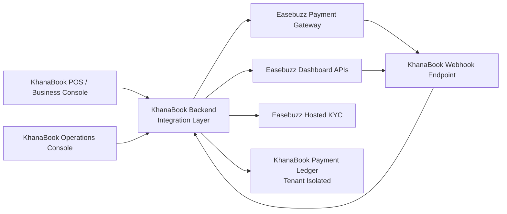
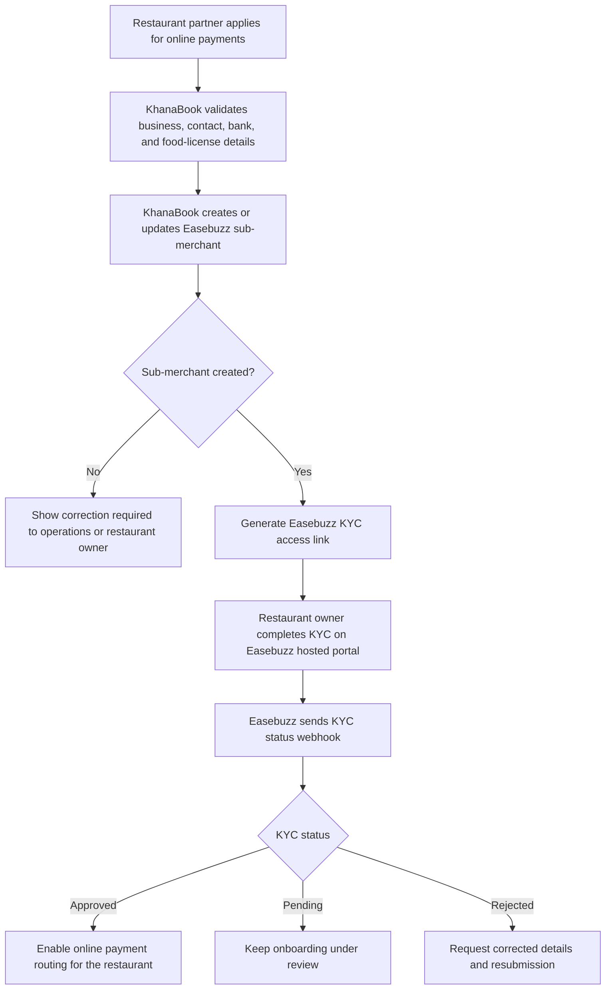
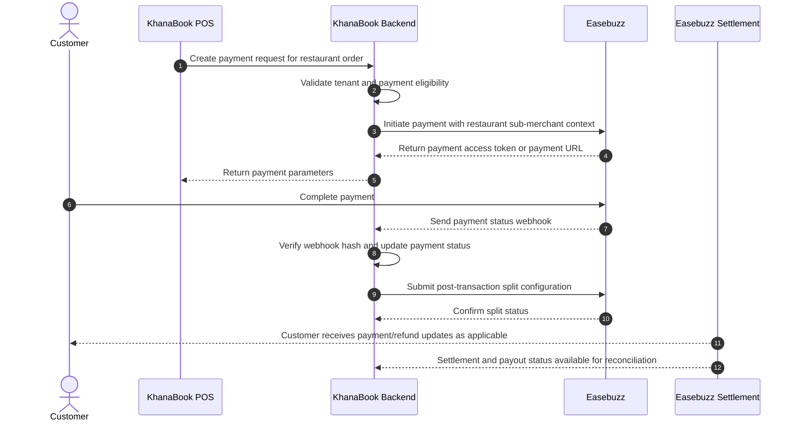
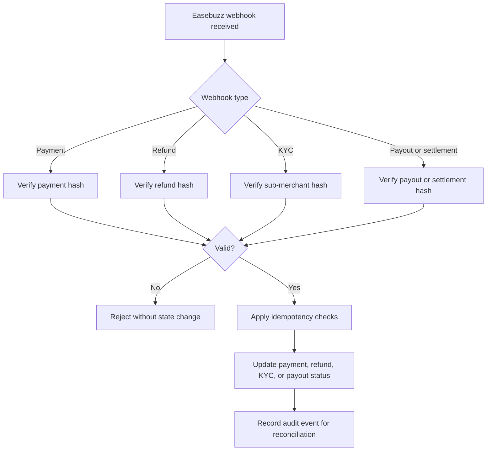

# KhanaBook Easebuzz Integration Review

## Purpose

KhanaBook integrates Easebuzz using a parent-submerchant marketplace model. KhanaBook acts as the parent merchant. Each restaurant partner is onboarded as an Easebuzz sub-merchant after KYC verification.

This document is intentionally limited to the Easebuzz integration boundary. It does not describe KhanaBook source code, internal modules, database schema, infrastructure topology, or unrelated product features.

## Integration Model

- Parent merchant: KhanaBook.
- Sub-merchant: One restaurant partner under the parent merchant.
- Payment collection: Customer payments are initiated through KhanaBook and processed by Easebuzz.
- Settlement routing: Successful transactions are split between the restaurant sub-merchant and KhanaBook commission.
- KYC: Restaurant KYC is completed using Easebuzz-hosted KYC flows.
- Webhooks: Easebuzz sends status updates to KhanaBook for payment, refund, KYC, payout, and settlement events.

## High-Level Architecture

## Onboarding and KYC

## Payment and Split Settlement

## Webhook Processing

## Easebuzz APIs Used

| Area | Easebuzz capability |
|---|---|
| Sub-merchant onboarding | Create/update sub-merchant |
| KYC | Generate KYC access key, verify OTP, resend OTP |
| Payment | Initiate payment, retrieve transaction status |
| Split settlement | Create split label, create/retrieve post-transaction split |
| Refunds | Initiate refund, retrieve refund status |
| Settlement and payout | On-demand settlement, payout transfer, settlement retrieve |
| Webhooks | Payment, refund, sub-merchant/KYC, payout/settlement callbacks |

## Security Controls Shared for Review

- Easebuzz hashes are generated only on the server.
- Merchant salt is never exposed to mobile or web clients.
- All inbound Easebuzz webhooks are hash-verified before processing.
- Duplicate payment and refund webhook deliveries are handled idempotently.
- Restaurant actions are tenant-isolated so one restaurant cannot access another restaurant's payment state.
- Bank and KYC-sensitive information is not exposed in shared review material.

## External Review Checklist

- [ ] Confirm parent-submerchant marketplace model is enabled.
- [ ] Confirm sub-merchant create/update APIs are enabled.
- [ ] Confirm hosted KYC access-key flow is enabled.
- [ ] Confirm OTP verify/resend APIs are enabled if required for sub-merchant onboarding.
- [ ] Confirm split label and post-transaction split APIs are enabled.
- [ ] Confirm payment, refund, KYC, payout, and settlement webhooks are enabled.
- [ ] Confirm live callback URLs before production go-live.
- [ ] Run one low-value live payment test.
- [ ] Verify payment webhook and transaction status reconciliation.
- [ ] Verify split settlement and settlement report reconciliation.
- [ ] Verify refund and refund-status flow.

