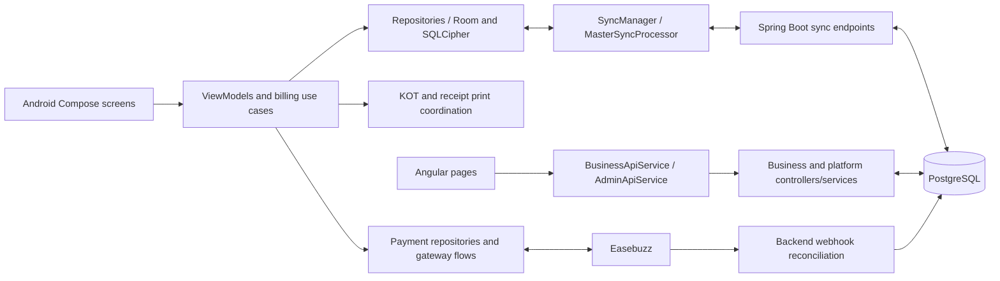

# KhanaBook codebase and design review

Reviewed 12 September 2026. Scope: current Android, web admin, and their backend dependencies. Preserve existing features; recommendations only. No application source, configuration, database, or deployment changes were made by this review.

## Assessment

The product has a good foundation: an identifiable restaurant brand, practical POS workflows, local persistence, explicit terminal identities, reusable UI components, and substantial reconciliation logic. The web desktop dashboard is reasonably organized. Android makes its main billing action and connectivity status easy to find.

It is not yet consistently polished, and the current uncommitted refactoring introduces behavior regressions that should take precedence over cosmetic changes. Keep the existing product and improve correctness, readability, and feature visibility within its established design system.

## How the project fits together

Graphify's existing graph reports 1,211 corpus files, 13,349 nodes, and 26,176 edges, built from commit `cdfa0914`, matching HEAD during this review. I used `query`, `explain`, and `path` for billing, sync, dashboard reads, and payment/printing concepts, then verified the relevant source. Some graph paths were absent or ambiguous, especially across HTTP boundaries. These are limitations of the graph, not proof that the application is disconnected. Uncommitted changes required direct source inspection beyond the graph snapshot.

This diagram summarizes verified source responsibilities; it is not an automatically proven Graphify call graph.

| Capability to preserve | Main source areas / contract |
|---|---|
| Offline bill creation and recovery | `BillingViewModel`, `BillCreationUseCase`, `BillRepository`, `BillDao`; local persistence before relying on connectivity |
| Cash, UPI, POS, split payments, payment links, cancellations, refunds | Payment screens/state, payment repositories, validated finalization, backend payment and refund services |
| Multiple terminals and invoice identity | `SessionManager`, terminal identity, invoice allocation, immutable bill `publicToken` reconciliation |
| Kitchen operations and printing | Active orders, new/added/voided KOT events, print queue/router, receipt reprinting; avoid duplicate remote-terminal printing |
| Menu, categories, variants, photographs, OCR, stock, staff permissions | Android repositories/managers and corresponding web pages/backend services |
| Operations and administration | Owner dashboard, order history, reports, daily closing, settings, devices; separate platform dashboard/business management |
| Customer-facing and payment integrations | Public order/invoice APIs and gateway onboarding/reconciliation; preserve existing capability and role gates |

This is a map of existing responsibilities, not a claim that every listed flow was exercised end to end.

## Review basis and constraints

- Reference commit: `cdfa091446bb812ee9f5952d1488ea63708ded4d`. Reviewed current source plus its working-tree diff and extracted untracked components. Other work was changing files during the review; important findings were reread before writing this report.
- This is a current-codebase review with a working-tree comparison, not a three-dot branch review. There was no user-supplied originating issue. Contracts came from `docs/meta/README.md`, `docs/planning/billing-sync-fix-verification.md`, `CONTEXT.md`, and current callers.
- Standards and specification assessments ran independently, following the code-review skill. They remain separate below.
- `docs/meta/AGENTS.md`, `docs/meta/ANDROID_UI_RULES.md`, and `docs/design/DESIGN_SYSTEM_FREEZE.md` take precedence over generic design preferences. Preserve Android's dark theme, Poppins typography, gradient, navigation patterns, and the existing token system. Home actions must remain reachable within the established density rules.
- Some older documents no longer match current implementation. For example, the web v1 spec excludes features now present, and the flat-page convention conflicts with current component extraction. Do not delete current functionality or reverse useful extraction merely to match those older descriptions.

## Standards

### S1. P1: OnPush was enabled without converting asynchronous staff state

**Current refactoring regression.** [StaffPageComponent](../../web-admin/src/app/pages/staff/staff-page.component.ts) enables OnPush at line 18 but changes ordinary `staff`, `loaded`, and `loadError` fields inside `loadStaff()` at lines 380–392. These assignments do not mark the page for checking.

**Observed:** a successful delayed fixture response left `loaded === true` and one staff member in component memory, while the rendered page did not show that member. Clicking Add Staff caused the directory to appear. This was checked alongside, and separately recorded from, the modal error below.

**Recommendation:** use a signal/observable-backed loading, success, and error state, or an explicit supported change-detection strategy. Preserve search, filtering, pagination, activation, errors, and retry. Audit other newly OnPush components with ordinary fields modified by asynchronous callbacks.

**Documented standard:** `docs/meta/AGENTS.md`, Web Admin State Management: “Use Angular Signals” and convert observable service results at the component boundary. The plain fields predate the refactor; OnPush creates the rendering consequence.

### S2. P1: extracted staff effects raise Angular runtime errors

**Current refactoring regression.** [StaffFormModalComponent](../../web-admin/src/app/pages/staff/staff-form-modal.component.ts), lines 130–149, writes `formError` within an effect without enabling signal writes. [StaffPermissionsModalComponent](../../web-admin/src/app/pages/staff/staff-permissions-modal.component.ts), lines 200–211, also invokes signal writes through `loadPermissions()` from an effect.

**Observed:** opening the staff route logged `NG0600: Writing to signals is not allowed in a computed or an effect by default`, with the stack pointing into the extracted form component. The permission path has the same source-level incompatibility but was not separately exercised.

**Recommendation:** make initialization compatible with the installed Angular 18 effect behavior. Verify create, edit, reopen, permission loading, and error recovery. Do not assume a successful compilation validates these interactions.

### S3. Maintainability judgment: duplicated billing calculation policy

[CartManager.kt](../../Android/app/src/main/java/com/khanabook/lite/pos/ui/viewmodel/CartManager.kt), line 134, and [BillCreationUseCase.kt](../../Android/app/src/main/java/com/khanabook/lite/pos/domain/manager/BillCreationUseCase.kt), line 324, separately choose GST versus custom tax and assemble totals. The current refactor activates both the displayed/validated calculation and a separate persisted calculation.

There is no demonstrated current arithmetic mismatch here. The risk is future divergence when one path changes. Share one pure calculation contract and summary type. Move the `BillingViewModel.CartItem` adapter out of the domain use-case file toward the presentation boundary. This preserves functionality while reducing the number of coordinated edits needed for a tax change.

**Standards result:** two functional regressions and one maintainability judgment. The most serious standards-related issues are staff rendering and modal initialization.

## Spec

### B1. P1: cancelling a new payment can persist a successful sale

**Current refactoring regression; confirmed through the current call chain.** [PaymentStep.kt](../../Android/app/src/main/java/com/khanabook/lite/pos/ui/screens/newbill/PaymentStep.kt), line 652, calls `completeOrder(FAILED, "Customer left")` from Payment Failed / Cancelled for a new order.

[BillingViewModel.kt](../../Android/app/src/main/java/com/khanabook/lite/pos/ui/viewmodel/BillingViewModel.kt), line 773, now always creates `BillIntent.Settle`. It does not pass the failure status or cancellation reason. [BillCreationUseCase.kt](../../Android/app/src/main/java/com/khanabook/lite/pos/domain/manager/BillCreationUseCase.kt), lines 191 and 295–299, stores an empty cancellation reason and `completed`/`success`, with payment creation. The repository's successful-sale path also consumes stock.

**Impact:** the operator can see the failed-payment flow while reports and inventory reflect a paid sale.

**Recommendation:** represent cancellation/failure explicitly in the creation contract and preserve the prior failed/cancelled behavior. Verify persisted order status, payment rows, cancellation reason, inventory, and printed output for both success and failure.

**Contract:** existing payment failure caller and baseline behavior; README promises billing, payments, refunds, and reports.

### B2. P1: pending split-payment allocation is lost on restoration

**Current refactoring regression; confirmed through persistence/restoration code.** [BillingViewModel.kt](../../Android/app/src/main/java/com/khanabook/lite/pos/ui/viewmodel/BillingViewModel.kt), line 622, creates parameterless `DraftForPayment`. [BillCreationUseCase.kt](../../Android/app/src/main/java/com/khanabook/lite/pos/domain/manager/BillCreationUseCase.kt), lines 181–187 and 301–305, saves zero split amounts and plain `upi` for this intent. Restoration at ViewModel line 528 reads those persisted fields.

**Example:** a ₹100 pending order selected as ₹40 cash plus ₹60 UPI restores as plain ₹100 UPI after the app loses the in-memory selection.

**Recommendation:** include the selected payment mode and allocation in the draft contract. Preserve them through restart, retry, gateway confirmation, and manual recovery.

**Contract:** `billing-sync-fix-verification.md` requires payment components with selected amounts and restoration of payment state.

### B3. P2: same-batch deduplication acknowledges a discarded update

**Current refactoring regression; source analysis, not a PostgreSQL reproduction.** [GenericSyncService.java](../../server/src/main/java/com/khanabook/saas/sync/service/GenericSyncService.java), lines 683–687, skips a repeated new bill `publicToken` while adding its local ID to the successful set.

A batch containing a new draft snapshot followed by a newer completed snapshot of the same token retains the first snapshot. The second never reaches the existing timestamp selection at lines 697–699. If aliases use different local IDs, the skipped alias also receives no persisted server-ID mapping.

**Recommendation:** resolve duplicate snapshots to an authoritative record before staging, preserve alias mappings as required, and acknowledge the outcome actually persisted. Test repeated identical snapshots, newer state, alias local IDs, and persistence failure.

**Contract:** immutable `publicToken` reconciliation and successful-ID/mapping acknowledgement in the README and billing/sync verification document.

### B4. Existing limitation: stock consumption is not durably coupled to finalization

[BillRepository.kt](../../Android/app/src/main/java/com/khanabook/lite/pos/data/repository/BillRepository.kt), around line 179, consumes inventory after bill finalization. A process interruption can leave the bill complete without its stock deduction. This is already explicitly deferred in `billing-sync-fix-verification.md`; it is not newly discovered refactoring damage.

Preserve current behavior while planning a durable, idempotent per-bill inventory operation. Treat this as a separate reliability change with its own verification.

### B5. Existing coverage limitation: use-case tests do not test creation behavior

[BillCreationUseCaseTest.kt](../../Android/app/src/test/java/com/khanabook/lite/pos/domain/manager/BillCreationUseCaseTest.kt) checks intent/parameter fields and locally repeated arithmetic without invoking `createBill()`. For example, the empty-cart test only asserts that the parameter list is empty.

Add behavior tests at the actual use-case/repository boundary before accepting the delegation refactor. Cover cancellation, successful settlement, split-draft restoration, repeat finalization, and tax agreement between displayed and saved totals.

**Spec result:** three current regressions, one documented existing limitation, and one existing coverage limitation. The worst issues are false successful sales and lost split-payment allocation.

## Web dashboard design and interaction findings

The desktop structure is understandable: navigation, headline metrics, trends, setup status, and recent orders. Readability and trust in the displayed information need attention.

| Priority | Finding and evidence | Improvement preserving the feature |
|---|---|---|
| P1 | At 390px, recent orders disappear. `styles.css:737` globally hides `.table-wrap > .data-table`; this dashboard supplies no mobile replacement. Browser confirmed `display: none` with fixture orders still present. | Scope table hiding to pages that provide equivalent mobile records, or retain an accessible scrolling fallback. |
| P2 | Orders and AOV chart tabs have no handlers (`business-dashboard-page.component.ts:126–128`). Clicking Orders left chart markup unchanged. | Wire all three tabs to their corresponding series and selected state. |
| P2 | If today's revenue is zero, the entire seven-day chart has zero-height bars despite nonzero earlier days (`:543`). Browser reproduced seven `0%` bars. | Normalize against the historical series maximum, with a true all-zero empty state. |
| P2 | A negative total-revenue comparison renders a green upward arrow (`:83`). Fixture week totals of ₹1,63,300 versus ₹1,80,000 displayed `▲ -9%`. | Derive direction, color, and wording from the sign; identify the exact comparison period. |
| P2 | Platform sparklines are fabricated from a single total (`platform-dashboard-page.component.ts:12–19`). They always slope upward. | Keep the metric; use real history for its sparkline or explicitly indicate that trend history is unavailable. |
| P2 | Recent-order headings and values disagree: Items displays `customerName`; Payment displays `sourceType`, often POS (`business-dashboard-page.component.ts:206–228`). | Show actual items and payment fields, or use accurate Customer and Source headings. |
| P2 | The date selector changes summary dates, while `getDashboardTrends()` receives no range (`:520–522`). The summary, today's value, and weekly comparison can describe different periods. | Define and display each period explicitly; apply the selected period consistently where appropriate. |
| P2 | Inactive desktop sidebar text has measured contrast of about 3.01:1 (`#6B655C` on `#1C1A17`). White on the current orange primary is about 2.90:1. | Reassign suitable existing text tokens; document measured accessibility justification if a locked token value must change. |

Additional observations: the intended bottom-action component currently renders only empty projected content; the mobile layout instead relies on the hamburger menu. Four large stacked metrics push operational details far down the phone page. Setup checks are displayed but do not take the owner to the needed setup action. Use compact metric grouping and direct setup links while keeping all existing data and actions.

The backend also loads the restaurant's entire bill history for both dashboard summary and trends (`BusinessReadService.java:69,325,392`). Move aggregation and date constraints into database queries as data grows. This is a source-level scaling concern, not a measured performance result. Its trends method truncates each `BigDecimal` amount through `longValue()` at line 412; keep consistent decimal or minor-unit precision so totals and trends agree.

## Android design assessment

**What works:** a prominent Create New Bill action, explicit offline/cloud status, familiar navigation, recognizable action icons, and payment/KOT badges with words as well as colors.

**What needs improvement:** the available Home screenshot shows a truncated restaurant name and a clipped Call Customer card. The active-order screenshot gives considerable vertical space to created/updated metadata while order actions and item details compete for attention. Gold headings, secondary text, values, borders, and controls produce a weak distinction between importance levels.

The current source includes responsive spacing and compact-height handling that may improve the older screenshots. The present Home still uses a constrained non-scrolling column, so large-font and short-window validation remains necessary. Do not claim the exact screenshot clipping was reproduced on the current APK.

Recommended changes within the existing design constraints:

1. Keep all existing Home actions and conditional behavior, but use the existing responsive layout tokens to fit them reliably at supported window sizes and font scales.
2. Keep sync status visible while allowing more room for the restaurant name. A compact status treatment can retain an expanded explanation when needed.
3. Use existing `TextLight` for information that must be read quickly. Reserve stronger emphasis for the bill total, next action, and exceptional status.
4. Make active-order timestamps compact, readable metadata. Keep the existing action grouping, with emphasis that reflects the order's current state.
5. Validate the established sticky-action, keyboard, and inset patterns on billing and settings screens; preserve the theme, typeface, navigation, and printing/payment flows.

## Suggested order of work

1. Correct B1/B2 and S1/S2, with behavior tests and browser checks that demonstrate preservation of the existing flows.
2. Correct B3 with sync tests covering duplicate batches and acknowledgement mappings.
3. Restore mobile data visibility and correct dashboard interactions, labels, comparisons, and numeric precision.
4. Consolidate calculation policy and reconcile stale documentation with the intended component boundaries.
5. Polish contrast, responsive density, and Android metadata using existing components/tokens, then perform device checks. Address durable inventory separately.

## Verification and evidence

- Angular development compilation succeeded for the reviewed snapshot. This was used for browser inspection; no production deployment occurred.
- Headless Chrome checked owner dashboard at 1440×1000 and 390×844, platform dashboard, staff loading, and a zero-revenue-today case. API responses used local sample fixtures. No customer data, production writes, or real transactions were used.
- External font/network resources were blocked in the fixture browser. Screenshots therefore include fallback fonts and must not be treated as exact production typography captures.
- Android was reviewed through current source, current callers, and repository screenshots. `adb devices -l` showed no connected device. No current-APK, printer, or payment-provider end-to-end validation was performed.
- No Android or backend test suite was run. The billing and batch findings are source-verified; their proposed acceptance tests remain to be implemented and run.
- The bundled design detector was attempted but unavailable: `Error: bundled detector not found.` Findings here come from source review, browser evidence, and manual design assessment.
- The Graphify workflow's referenced global skill file was absent; its installed CLI and existing graph were available and used. No graph rebuild was needed for this read-only source review.
- Both temporary Angular preview processes were stopped after inspection.

Screenshots, all using sample data:

- [Owner desktop](design-codebase-2026-09-12/web-owner-desktop.png)
- [Owner mobile: missing recent-order records](design-codebase-2026-09-12/web-owner-mobile.png)
- [Zero-revenue-today mobile: flattened history](design-codebase-2026-09-12/web-owner-zero-day-mobile.png)
- [Platform desktop](design-codebase-2026-09-12/web-platform-desktop.png)
- [Staff before a subsequent interaction](design-codebase-2026-09-12/web-staff-current.png)

Original Android references: [Home](../../Hiome.png), [Active Order](../screenshots/Screenshot_20260817_202758.png).
